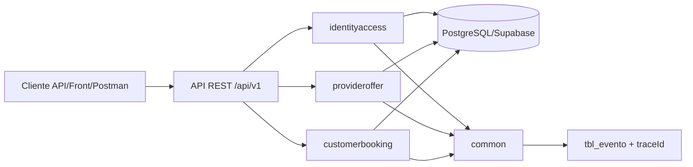

# EAP09 | Caso 15 | Reservas de Servicios - Backend


Backend del equipo **EAP09** para el **Caso 15**, enfocado en una plataforma de reservas por agenda y cupos.  
Este README documenta **el estado real implementado hasta hoy en Sprint 1**: sin humo, sin plantillas genéricas y sin funcionalidades inventadas.

---

## 1) Resumen Ejecutivo

La plataforma permite construir la oferta de un proveedor y sentar la base del flujo completo de reserva:

- registro de clientes y proveedores
- autenticación con JWT
- definición de horario general semanal del proveedor
- registro de servicios
- definición y bloqueo de disponibilidades por servicio

Estado actual del MVP Sprint 1:

- ✅ Implementado: **HU-01, HU-02, HU-03, HU-08, HU-09, HU-11**
- ⏳ Pendiente para cerrar el flujo de reserva: **HU-14, HU-15, HU-16**

---

## 2) Contexto del Caso y Motivación

En servicios agendables, el principal problema no es "guardar reservas", sino coordinar de forma consistente:

- actores con roles distintos (cliente/proveedor)
- autenticación y control de acceso
- horarios generales de atención
- servicios ofertados
- franjas de disponibilidad operables

Este backend resuelve esa base transaccional con trazabilidad y reglas de negocio, para que la reserva final se construya sobre datos coherentes.

Cadena funcional del producto:

1. Proveedor crea su cuenta y se autentica.
2. Proveedor define horario general y publica servicios.
3. Proveedor crea disponibilidades concretas por servicio.
4. Cliente crea su cuenta y se autentica.
5. Cliente consulta oferta/horarios y crea reserva (pendiente en HU-14/15/16).

---

## 3) Flujo de Sprint 1 (Historias Encadenadas)

El Sprint 1 está diseñado como una cadena funcional, no como historias aisladas:

- **HU-01 + HU-02**: crean los actores del sistema.
- **HU-03**: habilita acceso seguro por sesión JWT.
- **HU-08 + HU-09 + HU-11**: construyen la oferta publicable del proveedor.
- **HU-14 + HU-15 + HU-16**: cierran el flujo cliente -> consulta -> reserva.

En este repositorio ya está implementada toda la parte "actor + acceso + construcción de oferta".

---

## 4) Historias de Usuario Implementadas

### HU-01 - Registro de cliente

- **Objetivo**: crear cuenta cliente con validación de datos y contraseña robusta.
- **Implementado**:
    - validación de payload
    - control de correo duplicado
    - hash de contraseña con BCrypt
    - estado inicial de usuario desde catálogo
    - evento funcional `REGISTRO_CLIENTE`
- **Endpoint**:
    - `POST /api/v1/clients`

### HU-02 - Registro de proveedor

- **Objetivo**: crear cuenta proveedor bajo las mismas garantías de seguridad/validación.
- **Implementado**:
    - validación de payload
    - control de correo duplicado
    - hash con BCrypt
    - asignación de rol proveedor
    - evento funcional `REGISTRO_PROVEEDOR`
- **Endpoint**:
    - `POST /api/v1/providers`

### HU-03 - Autenticación de usuario

- **Objetivo**: iniciar sesión y emitir token JWT.
- **Implementado**:
    - autenticación por correo + contraseña
    - emisión de `accessToken` con `role` en claims
    - control de intentos fallidos consecutivos
    - restricción temporal de acceso por seguridad
    - verificación de cuenta activa
    - eventos `AUTENTICACION_USUARIO` y `APLICACION_RESTRICCION_ACCESO`
- **Endpoint**:
    - `POST /api/v1/auth/sessions`

### HU-08 - Definición de horario general

- **Objetivo**: permitir al proveedor definir/reemplazar horario semanal por día.
- **Implementado**:
    - acceso solo para proveedor autenticado
    - validación de día de semana
    - validación de rango horario
    - reemplazo para mismo día
    - evento `DEFINICION_HORARIO_GENERAL`
- **Endpoint**:
    - `PUT /api/v1/providers/me/general-schedule/{dayOfWeek}`

### HU-09 - Registro de servicio

- **Objetivo**: crear servicios ofertables por proveedor.
- **Implementado**:
    - acceso por JWT y rol proveedor
    - validaciones de nombre, descripción, duración y capacidad
    - unicidad de nombre por proveedor
    - estado inicial del servicio
    - evento `REGISTRO_SERVICIO`
- **Endpoint**:
    - `POST /api/v1/providers/me/services`

### HU-11 - Gestión de disponibilidad del servicio

- **Objetivo**: crear y bloquear franjas concretas para un servicio del proveedor.
- **Implementado**:
    - creación de disponibilidad con validaciones de fecha/hora
    - validación contra horario general del proveedor por día
    - detección de superposición de franjas
    - validación de propiedad del servicio
    - bloqueo por transición de estado (sin borrado)
    - eventos `CREACION_DISPONIBILIDAD` y `BLOQUEO_DISPONIBILIDAD`
- **Endpoints**:
    - `POST /api/v1/providers/me/services/{serviceId}/availabilities`
    - `PATCH /api/v1/providers/me/services/{serviceId}/availabilities/{availabilityId}/block`

---

## 5) Historias Pendientes para Cerrar MVP Sprint 1

- **HU-14 - Consulta de oferta disponible**
- **HU-15 - Consulta de horarios y cupos**
- **HU-16 - Creación de reserva**

Estas tres historias cierran el tramo cliente de la solución: explorar disponibilidad real y concretar una reserva válida sobre la oferta ya publicada por proveedores.

---

## 6) Arquitectura del Sistema

### Estilo arquitectónico

**Monolito modular en capas (layered modular monolith)**.

### Justificación técnica

- Reduce complejidad operativa en etapa temprana del producto.
- Mantiene separación clara por contexto de negocio.
- Facilita pruebas end-to-end con una sola unidad desplegable.
- Permite evolucionar módulos sin acoplar reglas de negocio en controladores CRUD simples.

### Módulos

- `identityaccess`: registro y autenticación.
- `provideroffer`: horario general, servicios y disponibilidades.
- `customerbooking`: reservado para consulta de oferta/slots y reservas (pendiente funcional).
- `common`: trazabilidad, respuestas, errores, eventos y utilitarios transversales.

### Capas por módulo

- `api`: contratos HTTP (controllers + DTOs).
- `application`: casos de uso y reglas de negocio.
- `domain`: entidades del modelo.
- `infrastructure`: repositorios y adaptadores de persistencia.

### Diagrama (visión de módulos)



---

## 7) Estructura de Carpetas (Vista Útil)

```text
.
├── src/main/java/com/eap09/reservas
│   ├── config/                 # API paths, CORS, config transversal
│   ├── security/               # JWT filter, user details, security config
│   ├── common/
│   │   ├── api/                # endpoints base públicos/protegidos
│   │   ├── audit/              # traceId y publicación de eventos
│   │   ├── exception/          # excepciones + manejador global uniforme
│   │   ├── response/           # ApiResponse / ErrorResponse
│   │   └── util/
│   ├── identityaccess/         # HU-01, HU-02, HU-03
│   ├── provideroffer/          # HU-08, HU-09, HU-11
│   └── customerbooking/        # bootstrap + base para HU-14/15/16
├── src/main/resources/
│   ├── application.yml
│   ├── application-dev.yml
│   └── db/migration/           # V1, V2, V3
├── src/test/java/              # tests unitarios, controller y e2e
├── EAP09 - Caso15 - ReservasServicios.postman_collection.json
├── .env.example
└── pom.xml
```

---

## 8) Stack Tecnológico y Uso en el Proyecto

| Tecnología | Uso real en este backend |
|---|---|
| Java 21 | Lenguaje base y runtime principal |
| Spring Boot 3.3.4 | Arranque, configuración y ciclo de vida de la app |
| Spring Web | API REST en `/api/v1` |
| Spring Security | Autenticación/autorización stateless con filtros |
| JJWT | Emisión y validación de JWT Bearer |
| BCrypt | Hash de contraseñas en registro y validación en login |
| Spring Data JPA | Persistencia relacional sobre entidades y repositorios |
| PostgreSQL (Supabase) | Base de datos transaccional del dominio |
| Flyway | Versionado de esquema y catálogos base/eventos |
| OpenAPI/Swagger | Contrato y exploración de API (`/swagger-ui.html`) |
| Spring HATEOAS | Links mínimos de navegación en endpoints clave |
| JUnit 5 + Mockito | Pruebas unitarias y de capa controller |
| Spring Boot Test | Pruebas de integración/e2e |
| Postman | Validación funcional/manual por HU |

---

## 9) Base de Datos y Persistencia

### Estado actual

- Integración activa con PostgreSQL (local o Supabase vía `DB_URL`).
- Modelo relacional con claves foráneas y catálogos de estado/evento.
- Migraciones administradas por Flyway al arranque.

### Migraciones presentes

- `V1__initial_schema.sql`
- `V2__seed_base_catalogs.sql`
- `V3__seed_event_catalogs.sql`

### Entidades de negocio clave del Sprint 1

- **Usuarios y roles**: `tbl_usuario`, `tbl_rol`
- **Estados centralizados**: `tbl_categoria_estado`, `tbl_estado`
- **Horario general proveedor**: `tbl_horario_general_proveedor`, `tbl_dia_semana`
- **Servicios**: `tbl_servicio`
- **Disponibilidades**: `tbl_disponibilidad_servicio`
- **Reservas**: `tbl_reserva` (estructura disponible; lógica HU-16 pendiente)
- **Trazabilidad/eventos**: `tbl_evento`, `tbl_tipo_evento`, `tbl_tipo_registro`

### Configuración segura por variables

No se almacenan secretos en el README ni en código fuente. La conexión se configura por entorno (`.env` + placeholders en `application.yml`).

---

## 10) Seguridad

### Esquema aplicado

- API stateless (`SessionCreationPolicy.STATELESS`).
- JWT Bearer para endpoints protegidos.
- BCrypt para almacenamiento de contraseñas.
- Validación de rol en casos de uso de proveedor.

### Política de contraseña (registración)

Aplicada por validación de DTO:

- mínimo 8 caracteres
- máximo 64 caracteres
- al menos una mayúscula
- al menos una minúscula
- al menos un número
- al menos un carácter especial

### Control de intentos fallidos y restricción temporal

En autenticación (`AuthenticationService`):

- máximo de intentos fallidos consecutivos: **5**
- restricción temporal al exceder límite: **15 minutos**
- reseteo de contador al autenticar correctamente

### Rutas públicas permitidas

- `/api/v1/public/**`
- `/api/v1/auth/sessions`
- `/api/v1/clients`
- `/api/v1/providers`
- `/swagger-ui/**`
- `/swagger-ui.html`
- `/v3/api-docs/**`
- `/actuator/health`
- `/actuator/info`

Todo el resto requiere autenticación.

---

## 11) Contrato API

### Convenciones

- Base path: **`/api/v1`**
- Estilo: REST con validación de payloads y respuestas uniformes
- Documentación interactiva: `GET /swagger-ui.html`

### Endpoints implementados hasta ahora

| HU | Método | Ruta | Módulo | Descripción | Auth |
|---|---|---|---|---|---|
| HU-01 | POST | `/api/v1/clients` | identityaccess | Registro de cliente | No |
| HU-02 | POST | `/api/v1/providers` | identityaccess | Registro de proveedor | No |
| HU-03 | POST | `/api/v1/auth/sessions` | identityaccess | Autenticación y JWT | No |
| HU-08 | PUT | `/api/v1/providers/me/general-schedule/{dayOfWeek}` | provideroffer | Definir/reemplazar horario general | Sí |
| HU-09 | POST | `/api/v1/providers/me/services` | provideroffer | Registrar servicio del proveedor | Sí |
| HU-11 | POST | `/api/v1/providers/me/services/{serviceId}/availabilities` | provideroffer | Crear disponibilidad del servicio | Sí |
| HU-11 | PATCH | `/api/v1/providers/me/services/{serviceId}/availabilities/{availabilityId}/block` | provideroffer | Bloquear disponibilidad existente | Sí |

### Endpoints auxiliares de estado/bootstrap

| Método | Ruta | Propósito |
|---|---|---|
| GET | `/api/v1/public/status` | Estado público básico |
| GET | `/api/v1/protected/status` | Estado protegido + usuario autenticado |
| GET | `/api/v1/auth/bootstrap` | Bootstrap de módulo identidad |
| GET | `/api/v1/protected/provider-offer/bootstrap` | Bootstrap de módulo oferta proveedor |
| GET | `/api/v1/protected/customer-booking/bootstrap` | Bootstrap de módulo reservas cliente |

---

## 12) Manejo de Errores y Trazabilidad

### Contrato de error uniforme

Todas las excepciones se normalizan en `GlobalExceptionHandler` con esta estructura:

```json
{
    "errorCode": "VALIDATION_ERROR",
    "message": "Validacion de la solicitud fallida",
    "details": ["campo: motivo"],
    "traceId": "..."
}
```

Campos:

- `errorCode`: código funcional/técnico normalizado
- `message`: mensaje principal
- `details`: lista de detalles (si aplica)
- `traceId`: correlación de request

### traceId en requests

- Header soportado: `X-Trace-Id`
- Si no llega uno, el backend genera UUID
- Se expone también en respuesta
- Se inyecta en logs por MDC

### Eventos funcionales y de seguridad

Los casos de uso publican eventos que se persisten en `tbl_evento` y además se registran en logs.

Eventos integrados en alcance actual:

- `REGISTRO_CLIENTE`
- `REGISTRO_PROVEEDOR`
- `AUTENTICACION_USUARIO`
- `APLICACION_RESTRICCION_ACCESO`
- `DEFINICION_HORARIO_GENERAL`
- `REGISTRO_SERVICIO`
- `CREACION_DISPONIBILIDAD`
- `BLOQUEO_DISPONIBILIDAD`

---

## 13) Pruebas

### Tipos de pruebas en el repositorio

- **Unitarias (application)**: validan reglas de negocio por caso de uso.
- **Controller tests (api)**: validan contrato HTTP, validaciones y códigos.
- **E2E/Integración**: levantan contexto, autentican contra API y validan persistencia/eventos reales.

### Historias con cobertura automatizada

- HU-01, HU-02, HU-03
- HU-08, HU-09, HU-11

### Comandos Maven útiles

Ejecutar toda la suite:

```bash
mvn test
```

Ejecutar solo HU-11:

```bash
mvn "-Dtest=ServiceAvailabilityServiceTest,ServiceAvailabilityControllerTest,ServiceAvailabilityE2ETest" test
```

Regresión Sprint 1 implementado (HU-08/09/11):

```bash
mvn "-Dtest=GeneralScheduleServiceTest,GeneralScheduleControllerTest,GeneralScheduleE2ETest,ServiceRegistrationServiceTest,ServiceRegistrationControllerTest,ServiceRegistrationE2ETest,ServiceAvailabilityServiceTest,ServiceAvailabilityControllerTest,ServiceAvailabilityE2ETest" test
```

Resultado de regresión más reciente en este repositorio:

- `Tests run: 69, Failures: 0, Errors: 0, Skipped: 0`
- `BUILD SUCCESS`

### ¿Cuándo considerar una HU "Done" desde backend?

Checklist mínimo recomendado:

1. Endpoint(s) implementados con contrato estable.
2. Validaciones funcionales y de seguridad activas.
3. Errores uniformes con `traceId`.
4. Persistencia correcta en BD relacional.
5. Evento(s) funcional(es) trazables.
6. Pruebas unitarias + controller + e2e en verde.
7. Casos manuales en Postman verificados.

---

## 14) Postman

Existe una colección versionada en el repo:

- `EAP09 - Caso15 - ReservasServicios.postman_collection.json`

### Organización

- `00 - Health & Setup`
- `01 - Sprint 1`
    - HU-01
    - HU-02
    - HU-03
    - HU-08
    - HU-09
    - HU-11
    - HU-14 / HU-15 / HU-16 (carpetas creadas, aún sin requests funcionales)

### Variables de environment sugeridas

- `baseUrl` -> ejemplo: `http://localhost:8080/api/v1`
- `providerToken`
- `clientToken`
- `otherProviderToken`
- `serviceId`
- `availabilityId`

### Uso recomendado

1. Importar colección.
2. Crear environment con variables anteriores.
3. Ejecutar HU-01/HU-02 para crear usuarios.
4. Ejecutar HU-03 para obtener tokens y guardarlos.
5. Probar HU-08 -> HU-09 -> HU-11 en orden.

Postman es clave para validación funcional, QA y sustentación docente porque deja evidencia reproducible de casos positivos/negativos.

---

## 15) Ejecución Local Paso a Paso

### Prerrequisitos

- Java 21
- Maven 3.9+
- PostgreSQL accesible (local o Supabase)

### 1. Clonar e ingresar

```bash
git clone <url-del-repo>
cd EAP09-Caso15-ReservasServicios-2026-1
```

### 2. Configurar variables

```bash
cp .env.example .env
```

Editar `.env` con valores reales (sin subirlo al repositorio).

### 3. Ejecutar backend

```bash
mvn clean spring-boot:run
```

### 4. Verificar salud y documentación

- Health: `GET /actuator/health`
- Swagger UI: `http://localhost:8080/swagger-ui.html`
- OpenAPI JSON: `http://localhost:8080/v3/api-docs`

### 5. Ejecutar pruebas

```bash
mvn test
```

### 6. Validar manualmente por API

- usar Swagger para exploración rápida
- usar Postman para escenarios por HU y regresión manual

---

## 16) Variables de Entorno

Variables mínimas requeridas:

```env
# PostgreSQL / Supabase
DB_URL=jdbc:postgresql://localhost:5432/eap09_reservas
DB_USERNAME=postgres
DB_PASSWORD=change_me

# JWT
JWT_SECRET=change_this_for_a_long_random_secret_at_least_32_bytes
JWT_EXPIRATION_SECONDS=1800

# CORS
CORS_ALLOWED_ORIGINS=http://localhost:3000,http://localhost:5173
```

Notas:

- `JWT_SECRET` debe ser robusto y privado.
- No subir `.env` ni secretos al control de versiones.
- El backend importa `.env` vía `spring.config.import`.

---

## 17) Estado Actual del Sprint 1

### Implementado

- Identidad y acceso:
    - HU-01 Registro de cliente
    - HU-02 Registro de proveedor
    - HU-03 Autenticación
- Oferta de proveedor:
    - HU-08 Horario general
    - HU-09 Registro de servicio
    - HU-11 Gestión de disponibilidad

### Probado

- pruebas unitarias, controller y e2e para historias implementadas
- regresión ejecutada en HU-08/HU-09/HU-11 en verde

### Pendiente para cierre de MVP Sprint 1

- HU-14 Consulta de oferta disponible
- HU-15 Consulta de horarios y cupos
- HU-16 Creación de reserva

---

## 18) Criterios de Proyecto Avanzado Aplicados Hasta Ahora

Este backend **ya refleja** (hasta su alcance actual) los criterios del proyecto avanzado:

- ✅ Integración backend + base de datos relacional
- ✅ Estilo arquitectónico explícito (monolito modular en capas)
- ✅ Módulos de negocio + módulo transversal
- ✅ Contrato API documentado con OpenAPI/Swagger
- ✅ Seguridad con JWT + BCrypt
- ✅ Validación de payloads y reglas de negocio
- ✅ Manejo uniforme de errores (`errorCode`, `message`, `details`, `traceId`)
- ✅ Trazabilidad por `traceId` y eventos funcionales/seguridad
- ✅ Suite de pruebas (unitarias, controller, e2e)
- ✅ Enfoque orientado a casos de uso, no solo CRUD

Pendiente de próximos sprints para completar el flujo end-to-end de reserva en lado cliente (HU-14/15/16).

---

## 19) Equipo

**EAP09**  
Caso 15 - Plataforma backend para reservas de servicios por agenda y cupos.

Si eres nuevo en el proyecto, este README es el punto de entrada recomendado para entender alcance, arquitectura y forma de ejecución/validación.
