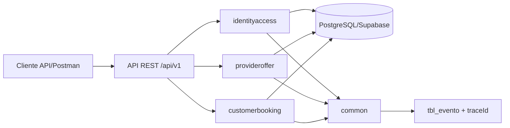

# EAP09 | Caso 15 | Reservas de Servicios - Backend


Backend del equipo **EAP09** para el **Caso 15**, enfocado en una plataforma de reservas por agenda y cupos.  
Este README documenta **el estado real implementado y estabilizado al cierre de Sprint 2**: sin humo, sin plantillas genéricas y sin funcionalidades inventadas.

> [!NOTE]
> Ruta oficial de documentación interactiva: **`/swagger-ui/index.html`**.
> En este README se usa esa única ruta para evitar ambigüedades.

---

## 1) Resumen Ejecutivo

La plataforma permite construir la oferta de un proveedor, ejecutar el flujo de reserva y operar su ciclo de vida funcional mínimo desde los dos actores principales:

- registro de clientes y proveedores
- autenticación y cierre de sesión con JWT
- actualización de perfil propio
- definición de horario general semanal del proveedor
- registro, activación e inactivación de servicios
- definicion y bloqueo de disponibilidades por servicio
- consulta de oferta disponible y horarios con cupos
- creación transaccional de reservas válidas
- consulta operativa de reservas del proveedor
- finalización de reservas atendidas
- cancelación de reservas por el cliente
- consulta de reservas del cliente

Estado actual del backend al cierre de Sprint 2:

- ✅ Implementado y estabilizado: **HU-01, HU-02, HU-03, HU-04, HU-05, HU-08, HU-09, HU-10, HU-11, HU-12, HU-13, HU-14, HU-15, HU-16, HU-17, HU-19**
- ✅ Flujo backend de punta a punta habilitado: **registro -> autenticación -> oferta -> consulta -> reserva -> operación posterior sobre la reserva**
- ✅ Estabilización final verificada: **`mvn clean test` y `mvn verify` en verde con 288 tests, 0 failures, 0 errors, 0 skipped**
- ✅ Cierre técnico honesto: se mantuvo la arquitectura original, se corrigieron defectos de persistencia y consulta, y se alinearon los E2E con el contrato HTTP real sin sobreingeniería

---

## 2) Contexto del Caso y Motivación

En servicios agendables, el principal problema no es "guardar reservas", sino coordinar de forma consistente:

- actores con roles distintos (cliente/proveedor)
- autenticación y control de acceso
- horarios generales de atención
- servicios ofertados
- franjas de disponibilidad operables
- estados funcionales de servicios y reservas
- trazabilidad de eventos y errores sin exponer detalles internos

Este backend resuelve esa base transaccional con trazabilidad y reglas de negocio, para que la reserva se construya y opere sobre datos coherentes sin salir del mismo monolito modular.

Cadena funcional del producto en el estado actual:

1. Cliente o proveedor crea su cuenta y se autentica.
2. El usuario autenticado puede cerrar sesión de forma segura y el cliente/proveedor puede mantener su perfil propio actualizado.
3. Proveedor define horario general, registra servicios, controla su estado operativo y crea disponibilidades concretas por servicio.
4. Cliente consulta oferta disponible y horarios con cupos reales.
5. Cliente confirma una reserva válida sobre una franja reservable.
6. Proveedor consulta sus reservas operativas y finaliza una reserva atendida cuando corresponde.
7. Cliente cancela reservas futuras propias y consulta la trazabilidad completa de sus reservas.

---

## 3) Alcance por Sprint

### Sprint 1

Sprint 1 construyó la base transaccional del producto y el flujo mínimo de reserva:

- **HU-01 + HU-02**: crean los actores del sistema.
- **HU-03**: habilita acceso seguro por sesión JWT.
- **HU-08 + HU-09 + HU-11**: construyen la oferta publicable del proveedor.
- **HU-14 + HU-15 + HU-16**: cierran el flujo cliente -> consulta -> reserva.

En este repositorio esa cadena quedó implementada y luego fue conservada durante la estabilización final.

### Sprint 2

Sprint 2 amplió el backend sin cambiar la arquitectura ni abrir alcance innecesario:

- **HU-04**: cierre de sesión segura
- **HU-05**: actualización de perfil propio
- **HU-10**: activación e inactivación de servicios propios
- **HU-12**: consulta operativa de reservas del proveedor
- **HU-13**: finalización de reservas atendidas
- **HU-17**: cancelación de reserva
- **HU-19**: consulta de reservas del cliente

Valor funcional del Sprint 2:

- el sistema ya no solo crea reservas; también permite operarlas y trazarlas
- el proveedor puede controlar oferta y seguimiento operativo
- el cliente puede gestionar su cuenta y el ciclo posterior de su reserva
- el backend quedó estabilizado con la suite completa en verde

---

## 3.1) Decisiones Funcionales Congeladas

Decisiones funcionales acordadas para mantener consistencia del dominio y evitar ambigüedades entre historias:

- proveedor registrado en Sprint 1 queda en estado **ACTIVA**
- horario general del proveedor se modela como **un único rango por día**
- disponibilidad se modela como **franja concreta con fecha real**
- la reserva nace en estado **CREADA**
- la capacidad restante se **calcula**, no se persiste como campo redundante
- un servicio puede pasar entre **ACTIVO** e **INACTIVO** sin afectar reservas ya creadas
- una reserva **CREADA** puede pasar a **FINALIZADA** o **CANCELADA** según reglas de tiempo, propiedad y estado
- la consulta operativa y la consulta de reservas del cliente son de solo lectura y no exponen datos ajenos

---

## 4) Historias de Usuario Implementadas

### HU-01 - Registro de cliente

- **Objetivo**: crear cuenta cliente con validación de datos y contraseña robusta.
- **Implementado**:
    - validación de payload
    - control de correo duplicado
    - hash de contraseña con BCrypt
    - estado inicial de usuario desde catálogo
    - evento funcional `REGISTRO_CLIENTE`
- **Endpoint**:
    - `POST /api/v1/clients`

### HU-02 - Registro de proveedor

- **Objetivo**: crear cuenta proveedor bajo las mismas garantías de seguridad/validación.
- **Implementado**:
    - validación de payload
    - control de correo duplicado
    - hash con BCrypt
    - asignación de rol proveedor
    - evento funcional `REGISTRO_PROVEEDOR`
- **Endpoint**:
    - `POST /api/v1/providers`

### HU-03 - Autenticación de usuario

- **Objetivo**: iniciar sesión y emitir token JWT.
- **Implementado**:
    - autenticación por correo + contraseña
    - emisión de `accessToken` con `role` en claims
    - control de intentos fallidos consecutivos
    - restricción temporal de acceso por seguridad
    - verificación de cuenta activa
    - eventos `AUTENTICACION_USUARIO` y `APLICACION_RESTRICCION_ACCESO`
- **Endpoint**:
    - `POST /api/v1/auth/sessions`

### HU-04 - Cierre de sesión segura

- **Objetivo**: cerrar la sesión JWT actual sin introducir estado de servidor tradicional.
- **Implementado**:
    - cierre de la sesión autenticada actual
    - validación de token Bearer en header `Authorization`
    - respuesta uniforme y trazable
- **Endpoint**:
    - `DELETE /api/v1/auth/sessions/current`

### HU-05 - Actualización de perfil propio

- **Objetivo**: permitir que el usuario autenticado mantenga actualizados sus datos básicos.
- **Implementado**:
    - actualización de nombres, apellidos y correo del propio perfil
    - validación de campos vacíos, formato de correo y correo duplicado
    - detección de solicitud sin cambios reales
    - evento funcional `ACTUALIZACION_PERFIL_USUARIO`
- **Endpoint**:
    - `PATCH /api/v1/users/me/profile`

### HU-08 - Definición de horario general

- **Objetivo**: permitir al proveedor definir/reemplazar horario semanal por día.
- **Implementado**:
    - acceso solo para proveedor autenticado
    - validación de día de semana
    - validación de rango horario
    - reemplazo para mismo día
    - evento `DEFINICION_HORARIO_GENERAL`
- **Endpoint**:
    - `PUT /api/v1/providers/me/general-schedule/{dayOfWeek}`

### HU-09 - Registro de servicio

- **Objetivo**: crear servicios ofertables por proveedor.
- **Implementado**:
    - acceso por JWT y rol proveedor
    - validaciones de nombre, descripción, duración y capacidad
    - unicidad de nombre por proveedor
    - estado inicial del servicio
    - evento `REGISTRO_SERVICIO`
- **Endpoint**:
    - `POST /api/v1/providers/me/services`

### HU-10 - Activación e inactivación de servicios propios

- **Objetivo**: permitir al proveedor controlar operativamente qué servicios quedan reservables.
- **Implementado**:
    - cambio de estado solo sobre servicios propios
    - validación de estado redundante
    - preservación de reservas ya creadas
    - evento funcional de activación/inactivación del servicio
- **Endpoint**:
    - `PATCH /api/v1/providers/me/services/{serviceId}/status`

### HU-11 - Gestión de disponibilidad del servicio

- **Objetivo**: crear y bloquear franjas concretas para un servicio del proveedor.
- **Implementado**:
    - creación de disponibilidad con validaciones de fecha/hora
    - validación contra horario general del proveedor por día
    - detección de superposición de franjas
    - validación de propiedad del servicio
    - bloqueo por transición de estado (sin borrado)
    - eventos `CREACION_DISPONIBILIDAD` y `BLOQUEO_DISPONIBILIDAD`
- **Endpoints**:
    - `POST /api/v1/providers/me/services/{serviceId}/availabilities`
    - `PATCH /api/v1/providers/me/services/{serviceId}/availabilities/{availabilityId}/block`

### HU-12 - Consulta operativa de reservas del proveedor

- **Objetivo**: permitir al proveedor consultar solo las reservas de sus propios servicios para gestionar la operación.
- **Implementado**:
    - consulta sin filtros y con filtros combinables por fecha, estado y servicio
    - validación de propiedad cuando se filtra por servicio
    - respuesta consistente para proveedor sin reservas o filtros sin resultados
    - consulta de solo lectura con trazabilidad mínima y control de acceso
- **Endpoint principal**:
    - `GET /api/v1/providers/me/bookings`

### HU-13 - Finalización de reservas atendidas

- **Objetivo**: permitir al proveedor marcar como finalizada una reserva atendida.
- **Implementado**:
    - validación de propiedad de la reserva respecto al proveedor autenticado
    - validación de estado actual y de que la franja ya terminó
    - cambio controlado de estado a `FINALIZADA`
    - trazabilidad funcional del cierre operativo
- **Endpoint principal**:
    - `PATCH /api/v1/providers/me/bookings/{bookingId}/finalization`

### HU-14 - Consulta de oferta disponible

- **Objetivo**: permitir al cliente autenticado consultar servicios reservables de proveedores activos.
- **Implementado**:
    - acceso para usuario autenticado con rol cliente
    - filtrado de oferta por servicio activo + proveedor activo + disponibilidad habilitada
    - respuesta uniforme con trazabilidad y HATEOAS mínimo
    - manejo de escenarios sin oferta sin romper contrato de respuesta
- **Endpoint principal**:
    - `GET /api/v1/offers`
- **Valor dentro del MVP**: habilita la exploración de oferta real antes de seleccionar proveedor/servicio para reservar.

### HU-15 - Consulta de horarios y cupos disponibles

- **Objetivo**: consultar por proveedor, servicio y fecha las franjas reservables y su cupo restante.
- **Implementado**:
    - validación de campos obligatorios (`providerId`, `serviceId`, `date`)
    - validación de relación proveedor-servicio activa
    - cálculo de cupo restante por franja en tiempo de consulta
    - exclusión de franjas bloqueadas/no reservables
    - control de acceso para rol cliente
- **Endpoint principal**:
    - `GET /api/v1/providers/{providerId}/services/{serviceId}/availabilities?date=YYYY-MM-DD`
- **Valor dentro del MVP**: permite tomar la decisión de reserva sobre disponibilidad y cupo reales.

### HU-16 - Creación de reserva

- **Objetivo**: crear una reserva válida y persistente para una franja seleccionada por el cliente autenticado.
- **Implementado**:
    - endpoint autenticado de cliente para confirmar reserva
    - revalidación final de proveedor activo, servicio activo y franja habilitada
    - validación de consistencia proveedor-servicio-franja
    - validación de cupo disponible sobre reservas en estado `CREADA`
    - creación transaccional de reserva con estado inicial `CREADA`
    - trazabilidad funcional con evento `CREACION_RESERVA`
    - endurecimiento de errores para no exponer detalles internos de BD
- **Endpoint principal**:
    - `POST /api/v1/bookings`
- **Valor dentro del MVP**: materializa la operación principal del sprint al concretar una reserva real, consistente y auditable.

### HU-17 - Cancelación de reserva

- **Objetivo**: permitir al cliente cancelar una reserva propia futura sin eliminarla físicamente.
- **Implementado**:
    - validación de propiedad de la reserva respecto al cliente autenticado
    - validación de estado actual y de que la franja aún no ha iniciado
    - cambio controlado de estado a `CANCELADA`
    - efecto operativo coherente sobre cupos al dejar de contar como reserva activa
- **Endpoint principal**:
    - `PATCH /api/v1/bookings/{bookingId}/cancellation`

### HU-19 - Consulta de reservas del cliente

- **Objetivo**: permitir al cliente consultar la trazabilidad de sus propias reservas.
- **Implementado**:
    - devolución de servicio, proveedor, fecha, franja y estado
    - consulta de solo lectura limitada a la cuenta autenticada
    - respuesta consistente cuando no existen reservas
    - trazabilidad y control de acceso por rol cliente
- **Endpoint principal**:
    - `GET /api/v1/bookings/me`

---

## 5) Historias Pendientes

Para el alcance de backend documentado en este repositorio al cierre de Sprint 2, no quedan historias abiertas dentro del conjunto ya implementado y estabilizado.

El crecimiento natural siguiente corresponde a evolución funcional posterior al alcance mínimo ya entregado, no a cerrar vacíos de Sprint 1 o Sprint 2.

---

## 6) Arquitectura del Sistema

### Estilo arquitectónico

**Monolito modular en capas (layered modular monolith)**.

### Justificación técnica

- Reduce complejidad operativa en etapa temprana del producto.
- Mantiene separación clara por contexto de negocio.
- Facilita pruebas end-to-end con una sola unidad desplegable.
- Permite evolucionar módulos sin acoplar reglas de negocio en controladores CRUD simples.
- Permitió ampliar Sprint 2 y estabilizarlo sin migrar de arquitectura ni fragmentar el dominio artificialmente.

### Módulos

- `identityaccess`: registro y autenticación.
- `provideroffer`: horario general, servicios, estado de servicios y disponibilidades.
- `customerbooking`: consulta de oferta, consulta de horarios/cupos, creación de reservas y ciclo posterior de reservas.
- `common`: trazabilidad, respuestas, errores, eventos y utilitarios transversales.

### Capas por módulo

- `api`: contratos HTTP (controllers + DTOs).
- `application`: casos de uso y reglas de negocio.
- `domain`: entidades del modelo.
- `infrastructure`: repositorios y adaptadores de persistencia.

### Diagrama (visión de módulos)



---

## 7) Estructura de Carpetas (Vista útil)

```text
.
├── src/main/java/com/eap09/reservas/
│   ├── config/                 # rutas base API, CORS, configuración transversal
│   ├── security/               # JWT filter, security config, user details
│   ├── common/
│   │   ├── api/                # endpoints base públicos/protegidos
│   │   ├── audit/              # traceId y publicación de eventos
│   │   ├── exception/          # excepciones + manejador global uniforme
│   │   ├── response/           # ApiResponse / ErrorResponse
│   │   └── util/
│   ├── identityaccess/         # HU-01, HU-02, HU-03, HU-04, HU-05
│   ├── provideroffer/          # HU-08, HU-09, HU-10, HU-11
│   └── customerbooking/        # HU-12, HU-13, HU-14, HU-15, HU-16, HU-17, HU-19
├── src/main/resources/
│   ├── application.yml
│   ├── application-dev.yml
│   └── db/migration/           # 01_schema_reset.sql, 02_seed_catalogos.sql, 03_seed_operativo_sprint2.sql
├── src/test/java/              # tests unitarios, controller y e2e
├── .env.example
└── pom.xml
```

---

## 8) Stack tecnológico y Uso en el Proyecto

| Tecnología | Uso real en este backend |
|---|---|
| Java 21 | Lenguaje base y runtime principal |
| Spring Boot 3.3.4 | Arranque, configuración y ciclo de vida de la app |
| Spring Web | API REST en `/api/v1` |
| Spring Security | Autenticación/autorización stateless con filtros |
| JJWT | Emisión y validación de JWT Bearer |
| BCrypt | Hash de contraseñas en registro y validación en login |
| Spring Data JPA | Persistencia relacional sobre entidades y repositorios |
| PostgreSQL (Supabase) | Base de datos transaccional del dominio |
| Flyway | Versionado de esquema y catálogos base/eventos |
| OpenAPI/Swagger | Contrato y exploración de API (`/swagger-ui/index.html`) |
| Spring HATEOAS | Links mínimos de navegación en endpoints clave |
| JUnit 5 + Mockito | Pruebas unitarias y de capa controller |
| Spring Boot Test | Pruebas de integración/e2e |
| Postman | Validación funcional/manual por HU |

---

## 9) Base de Datos y Persistencia

### Estado actual

- Integración activa con PostgreSQL, usando Supabase como entorno principal del proyecto.
- Modelo relacional con claves foráneas y catálogos de estado/evento.
- Migraciones administradas por Flyway al arranque.
- El cierre de Sprint 2 mantuvo el mismo modelo relacional y corrigió defectos de persistencia e integración sin abrir tablas innecesarias.

### Entornos de base de datos

| Entorno | Uso | Configuración |
|---|---|---|
| Supabase (PostgreSQL) | Entorno real de trabajo del proyecto | Variables de entorno (`DB_URL`, `DB_USERNAME`, `DB_PASSWORD`) |
| PostgreSQL local (opcional) | Desarrollo/pruebas locales | Mismas variables apuntando a instancia local |

La aplicación no depende de credenciales hardcodeadas: cambia únicamente el valor de variables según el entorno.

### Migraciones presentes

- `01_schema_reset.sql`
- `02_seed_catalogos.sql`
- `03_seed_operativo_sprint2.sql`

### Entidades de negocio clave del estado actual

- **Usuarios y roles**: `tbl_usuario`, `tbl_rol`
- **Estados centralizados**: `tbl_categoria_estado`, `tbl_estado`
- **Horario general proveedor**: `tbl_horario_general_proveedor`, `tbl_dia_semana`
- **Servicios**: `tbl_servicio`
- **Disponibilidades**: `tbl_disponibilidad_servicio`
- **Reservas**: `tbl_reserva` (creación, cancelación, finalización y consulta)
- **Trazabilidad/eventos**: `tbl_evento`, `tbl_tipo_evento`, `tbl_tipo_registro`

El modelo relacional ya soporta el flujo implementado y estabilizado de Sprint 1 y Sprint 2: alta de actores, autenticación, publicación de oferta, consulta de disponibilidad con cupo, reserva y operación posterior sobre reservas.

### Estados centralizados (`tbl_categoria_estado` + `tbl_estado`)

El modelo usa un catálogo único de estados para múltiples agregados. Esto evita duplicar catálogos por tabla, mejora consistencia de reglas y simplifica trazabilidad funcional.

Ejemplo simplificado:

| Categoría (`tbl_categoria_estado`) | Estados (`tbl_estado`) |
|---|---|
| `tbl_usuario` | `ACTIVA`, `INACTIVA` |
| `tbl_servicio` | `ACTIVO`, `INACTIVO` |
| `tbl_disponibilidad_servicio` | `HABILITADA`, `BLOQUEADA` |
| `tbl_reserva` | `CREADA`, `CANCELADA`, `FINALIZADA` |

Este enfoque permite evolucionar reglas de negocio sin romper contratos ni replicar lógica de estados en distintos módulos.

### Cierre técnico relevante de persistencia

Durante la estabilización final de Sprint 2 quedaron absorbidos por el código actual tres ajustes técnicos concretos:

- la creación de reservas maneja correctamente `fechaActualizacionReserva`
- las consultas de reservas de cliente y proveedor quedaron estabilizadas sobre PostgreSQL real
- se mantuvo la misma arquitectura y el mismo esquema base, corrigiendo integración real sin sobreingeniería

### Configuración segura por variables

No se almacenan secretos en el README ni en código fuente. La conexión se configura por entorno (`.env` + placeholders en `application.yml`).

---

## 10) Seguridad

### Esquema aplicado

- API stateless (`SessionCreationPolicy.STATELESS`).
- JWT Bearer para endpoints protegidos.
- BCrypt para almacenamiento de contraseñas.
- Validación de rol en casos de uso de proveedor y cliente según HU.
- Cierre seguro de la sesión actual mediante endpoint dedicado.
- Uso consistente de rutas `/me` para operaciones propias de usuario, proveedor y cliente.

### Política de contraseña (registración)

Aplicada por validación de DTO:

- mínimo 8 caracteres
- máximo 64 caracteres
- al menos una mayúscula
- al menos una minúscula
- al menos un número
- al menos un carácter especial

### Control de intentos fallidos y restricción temporal

En autenticación (`AuthenticationService`):

- máximo de intentos fallidos consecutivos: **5**
- restricción temporal al exceder límite: **15 minutos**
- reseteo de contador al autenticar correctamente

### Protección de información sensible

- Contrato uniforme de error: `errorCode`, `message`, `details`, `traceId`.
- Manejo centralizado en `GlobalExceptionHandler`.
- Endurecimiento de errores internos para evitar fuga de SQL, constraints o detalles internos de PostgreSQL.
- Mensajes funcionales en español, sin exponer internals de persistencia.
- La estabilización final preservó este criterio y no agregó atajos de seguridad para compensar problemas de tests.

### Rutas públicas permitidas

- `/api/v1/public/**`
- `/api/v1/auth/sessions`
- `/api/v1/clients`
- `/api/v1/providers`
- `/swagger-ui/**`
- `/v3/api-docs/**`
- `/actuator/health`
- `/actuator/info`

Todo el resto requiere autenticación.

---

## 11) Contrato API

### Convenciones

- Base path: **`/api/v1`**
- Estilo: REST con validación de payloads y respuestas uniformes
- Documentación interactiva oficial: `GET /swagger-ui/index.html`

### Endpoints implementados por HU

| HU | Método | Ruta | Módulo | Descripción | Auth | Rol esperado |
|---|---|---|---|---|---|---|
| HU-01 | POST | `/api/v1/clients` | identityaccess | Registro de cliente | No | N/A |
| HU-02 | POST | `/api/v1/providers` | identityaccess | Registro de proveedor | No | N/A |
| HU-03 | POST | `/api/v1/auth/sessions` | identityaccess | Autenticación y emisión JWT | No | N/A |
| HU-04 | DELETE | `/api/v1/auth/sessions/current` | identityaccess | Cierre seguro de la sesión actual | Sí | Usuario autenticado |
| HU-05 | PATCH | `/api/v1/users/me/profile` | identityaccess | Actualización del perfil propio | Sí | Usuario autenticado |
| HU-08 | PUT | `/api/v1/providers/me/general-schedule/{dayOfWeek}` | provideroffer | Definir/reemplazar horario general | Sí | PROVEEDOR |
| HU-09 | POST | `/api/v1/providers/me/services` | provideroffer | Registrar servicio del proveedor | Sí | PROVEEDOR |
| HU-10 | PATCH | `/api/v1/providers/me/services/{serviceId}/status` | provideroffer | Activar o inactivar servicio propio | Sí | PROVEEDOR |
| HU-11 | POST | `/api/v1/providers/me/services/{serviceId}/availabilities` | provideroffer | Crear disponibilidad del servicio | Sí | PROVEEDOR |
| HU-11 | PATCH | `/api/v1/providers/me/services/{serviceId}/availabilities/{availabilityId}/block` | provideroffer | Bloquear disponibilidad existente | Sí | PROVEEDOR |
| HU-12 | GET | `/api/v1/providers/me/bookings` | customerbooking | Consulta operativa de reservas del proveedor | Sí | PROVEEDOR |
| HU-13 | PATCH | `/api/v1/providers/me/bookings/{bookingId}/finalization` | customerbooking | Finalizar una reserva atendida | Sí | PROVEEDOR |
| HU-14 | GET | `/api/v1/offers` | customerbooking | Consultar oferta disponible | Sí | CLIENTE |
| HU-15 | GET | `/api/v1/providers/{providerId}/services/{serviceId}/availabilities?date=YYYY-MM-DD` | customerbooking | Consultar horarios y cupos disponibles | Sí | CLIENTE |
| HU-16 | POST | `/api/v1/bookings` | customerbooking | Crear reserva válida sobre franja seleccionada | Sí | CLIENTE |
| HU-17 | PATCH | `/api/v1/bookings/{bookingId}/cancellation` | customerbooking | Cancelar reserva propia | Sí | CLIENTE |
| HU-19 | GET | `/api/v1/bookings/me` | customerbooking | Consultar reservas del cliente autenticado | Sí | CLIENTE |

### Endpoints auxiliares de estado/bootstrap

| Método | Ruta | Propósito |
|---|---|---|
| GET | `/api/v1/public/status` | Estado público básico |
| GET | `/api/v1/protected/status` | Estado protegido + usuario autenticado |
| GET | `/api/v1/auth/bootstrap` | Bootstrap de módulo identidad |
| GET | `/api/v1/protected/provider-offer/bootstrap` | Bootstrap de módulo oferta proveedor |
| GET | `/api/v1/protected/customer-booking/bootstrap` | Bootstrap de módulo reservas cliente |

---

## 12) Manejo de Errores y Trazabilidad

### Contrato de error uniforme

Todas las excepciones se normalizan en `GlobalExceptionHandler` con esta estructura:

```json
{
    "errorCode": "VALIDATION_ERROR",
    "message": "Validacion de la solicitud fallida",
    "details": ["campo: motivo"],
    "traceId": "..."
}
```

Campos:

- `errorCode`: código funcional/técnico normalizado
- `message`: mensaje principal
- `details`: lista de detalles (si aplica)
- `traceId`: correlación de request

### traceId en requests

- Header soportado: `X-Trace-Id`
- Si no llega uno, el backend genera UUID
- Se expone también en respuesta
- Se inyecta en logs por MDC

### Eventos funcionales y de seguridad

Los casos de uso publican eventos que se persisten en `tbl_evento` y además se registran en logs.

Eventos integrados en alcance actual:

- `REGISTRO_CLIENTE`
- `REGISTRO_PROVEEDOR`
- `AUTENTICACION_USUARIO`
- `APLICACION_RESTRICCION_ACCESO`
- `ACTUALIZACION_PERFIL_USUARIO`
- `DEFINICION_HORARIO_GENERAL`
- `REGISTRO_SERVICIO`
- `ACTIVACION_SERVICIO`
- `INACTIVACION_SERVICIO`
- `CREACION_DISPONIBILIDAD`
- `BLOQUEO_DISPONIBILIDAD`
- `CREACION_RESERVA`
- eventos funcionales asociados a consulta, cancelación y finalización de reservas según el caso de uso correspondiente

---

## 13) Pruebas

### Tipos de pruebas en el repositorio

- **Unitarias (application)**: validan reglas de negocio por caso de uso.
- **Controller tests (api)**: validan contrato HTTP, validaciones y códigos.
- **E2E/Integración**: levantan contexto, autentican contra API y validan persistencia y eventos reales.

### Flujo mínimo para probar endpoints protegidos

1. Autenticar con `POST /api/v1/auth/sessions`.
2. Extraer `accessToken` de la respuesta.
3. Enviar header `Authorization: Bearer <token>`.
4. Consumir endpoints protegidos según rol (por ejemplo HU-08/09/11 con proveedor y HU-14/15/16 con cliente).

Ejemplo de header:

```http
Authorization: Bearer eyJhbGciOi...
```

### Historias con cobertura automatizada

- HU-01, HU-02, HU-03, HU-04, HU-05
- HU-08, HU-09, HU-10, HU-11
- HU-12, HU-13, HU-14, HU-15, HU-16, HU-17, HU-19

### Comandos Maven útiles

Ejecutar toda la suite:

```bash
mvn test
```

Validación final de estabilización ejecutada sobre este repositorio:

```bash
mvn clean test -B --no-transfer-progress
mvn verify -B --no-transfer-progress
```

Ejecutar solo HU-11:

```bash
mvn "-Dtest=ServiceAvailabilityServiceTest,ServiceAvailabilityControllerTest,ServiceAvailabilityE2ETest" test
```

Regresión de service/controller por módulos:

```bash
mvn "-Dtest=*ControllerTest,*ServiceTest" test
```

Validación E2E de customer booking (HU-14/15/16):

```bash
mvn "-Dtest=CustomerBookingOfferE2ETest,CustomerBookingAvailabilityE2ETest,CustomerBookingReservationE2ETest" test
```

Resultado de validación final más reciente en este repositorio:

- `Tests run: 288, Failures: 0, Errors: 0, Skipped: 0`
- `mvn clean test` -> `BUILD SUCCESS`
- `mvn verify` -> `BUILD SUCCESS`

Observaciones técnicas del cierre:

- se corrigió la persistencia de reservas para manejar correctamente `fechaActualizacionReserva`
- se estabilizaron las consultas de reservas de cliente y proveedor
- se alinearon pruebas E2E con el contrato HTTP real de autenticación y horarios generales
- se mantuvo la arquitectura y el alcance sin sobreingeniería

Además de la automatización, las HU de Sprint 1 y Sprint 2 se validaron manualmente con Postman en escenarios positivos y negativos.

### ¿Cuándo considerar una HU "Done" desde backend?

Checklist mínimo recomendado:

1. Endpoint(s) implementados con contrato estable.
2. Validaciones funcionales y de seguridad activas.
3. Errores uniformes con `traceId`.
4. Persistencia correcta en BD relacional.
5. Evento(s) funcional(es) trazables.
6. Pruebas unitarias + controller + e2e en verde.
7. Casos manuales en Postman verificados.

---

## 14) Postman

El proyecto se ha validado manualmente con Postman, pero en el estado actual del workspace no hay una colección versionada disponible en la raíz del repositorio. Por eso, esta sección documenta el uso real recomendado sin inventar una estructura cerrada de archivos que hoy no está presente.

### Organización recomendada

Para revisión técnica y sustentación conviene organizar las solicitudes manuales por sprint e historia de usuario, separando al menos:

- health y autenticación
- construcción y control de oferta del proveedor
- flujo cliente de consulta y reserva
- operación posterior de reservas en Sprint 2

### Variables de environment sugeridas

- `baseUrl` -> ejemplo: `http://localhost:8080/api/v1`
- `providerToken`
- `clientToken`
- `otherProviderToken`
- `serviceId`
- `availabilityId`
- `providerId`
- `bookingId`
- `bookingIdPast`
- `bookingIdFuture`
- `date`

### Uso recomendado

1. Crear o importar una colección de trabajo en Postman.
2. Crear environment con variables anteriores.
3. Ejecutar HU-01/HU-02 para crear usuarios.
4. Ejecutar HU-03 para obtener tokens y guardarlos.
5. Probar HU-08 -> HU-09 -> HU-10 -> HU-11 para construir y controlar oferta.
6. Probar HU-14 -> HU-15 -> HU-16 para validar el flujo cliente de reserva.
7. Probar HU-12 -> HU-13 desde proveedor y HU-17 -> HU-19 desde cliente para validar la operación posterior.

Nota práctica para endpoints protegidos:

- usar `providerToken` en endpoints de proveedor (HU-08/09/10/11/12/13)
- usar `clientToken` en endpoints de cliente (HU-14/15/16/17/19)

Postman es clave para validación funcional, QA y sustentación docente porque deja evidencia reproducible de casos positivos/negativos.

---

## 15) Flujo sugerido de demo

Subsección recomendada para sustentación de Sprint 2:

1. Login de proveedor con `POST /api/v1/auth/sessions`.
2. Inactivar un servicio propio con `PATCH /api/v1/providers/me/services/{serviceId}/status`.
3. Consultar reservas del proveedor con `GET /api/v1/providers/me/bookings`.
4. Finalizar una reserva atendida con `PATCH /api/v1/providers/me/bookings/{bookingId}/finalization`.
5. Login de cliente con `POST /api/v1/auth/sessions`.
6. Cancelar una reserva propia futura con `PATCH /api/v1/bookings/{bookingId}/cancellation`.
7. Consultar reservas del cliente con `GET /api/v1/bookings/me`.

Este flujo muestra valor de negocio real: control de oferta, operación del proveedor, autogestión del cliente y trazabilidad del ciclo posterior de la reserva.

---

## 16) Ejecución Local Paso a Paso

### Prerrequisitos

- Java 21
- Maven 3.9+
- PostgreSQL accesible (local o Supabase)

### 1. Clonar e ingresar

```bash
git clone <url-del-repo>
cd EAP09-Caso15-ReservasServicios-2026-1
```

### 2. Configurar variables

```bash
cp .env.example .env
```

En PowerShell (Windows), alternativa equivalente:

```powershell
Copy-Item .env.example .env
```

Editar `.env` con valores reales (sin subirlo al repositorio).

### 3. Ejecutar backend

```bash
mvn clean spring-boot:run
```

### 4. Verificar salud y documentación

- Health: `GET /actuator/health`
- Swagger UI: `http://localhost:8080/swagger-ui/index.html`
- OpenAPI JSON: `http://localhost:8080/v3/api-docs`

### 5. Ejecutar pruebas

```bash
mvn test
```

Validación fuerte recomendada al cierre de cambios relevantes:

```bash
mvn clean test -B --no-transfer-progress
mvn verify -B --no-transfer-progress
```

### 6. Validar manualmente por API

- usar Swagger para exploración rápida
- usar Postman para escenarios por HU y regresión manual
- validar primero autenticación, luego flujo proveedor y finalmente flujo cliente para reducir cruces de contexto

---

## 17) Variables de Entorno

Variables mínimas requeridas:

```env
# PostgreSQL / Supabase
DB_URL=jdbc:postgresql://localhost:5432/eap09_reservas
DB_USERNAME=postgres
DB_PASSWORD=change_me

# JWT
JWT_SECRET=change_this_for_a_long_random_secret_at_least_32_bytes
JWT_EXPIRATION_SECONDS=1800

# CORS
CORS_ALLOWED_ORIGINS=http://localhost:3000,http://localhost:5173
```

Notas:

- `JWT_SECRET` debe ser robusto y privado.
- No subir `.env` ni secretos al control de versiones.
- El backend importa `.env` vía `spring.config.import`.

---

## 18) Estado Actual del Proyecto

### Implementado

- Identidad y acceso:
    - HU-01 Registro de cliente
    - HU-02 Registro de proveedor
    - HU-03 Autenticación
    - HU-04 Cierre de sesión segura
    - HU-05 Actualización de perfil propio
- Oferta de proveedor:
    - HU-08 Horario general
    - HU-09 Registro de servicio
    - HU-10 Activación e inactivación de servicios propios
    - HU-11 Gestión de disponibilidad
- Reservas y operación posterior:
    - HU-12 Consulta operativa de reservas del proveedor
    - HU-13 Finalización de reservas atendidas
    - HU-14 Consulta de oferta disponible
    - HU-15 Consulta de horarios y cupos disponibles
    - HU-16 Creación de reserva
    - HU-17 Cancelación de reserva
    - HU-19 Consulta de reservas del cliente

### Probado

- pruebas unitarias, controller y e2e/integración para historias implementadas
- validación manual por HU con Postman
- validación final en verde con `mvn clean test` y `mvn verify`

### Conclusiones del cierre técnico

- El backend ya no documenta solo Sprint 1; queda cerrado y estabilizado hasta Sprint 2.
- Ya existe flujo funcional de extremo a extremo: registro/autenticación -> oferta -> consulta -> reserva -> operación posterior de la reserva.
- El proyecto se mantiene como backend con integración PostgreSQL/Supabase y migraciones Flyway.
- La estabilización final corrigió defectos reales de persistencia y consulta sin cambiar la arquitectura ni ampliar artificialmente el alcance.

---

## 19) Criterios de Proyecto Avanzado Aplicados Hasta Ahora

Este backend **ya refleja** (hasta su alcance actual y estabilizado) los criterios del proyecto avanzado:

- ✅ Integración backend + base de datos relacional
- ✅ Estilo arquitectónico explícito (monolito modular en capas)
- ✅ Módulos de negocio + módulo transversal
- ✅ Contrato API documentado con OpenAPI/Swagger
- ✅ Seguridad con JWT + BCrypt
- ✅ Validación de payloads y reglas de negocio
- ✅ Manejo uniforme de errores (`errorCode`, `message`, `details`, `traceId`)
- ✅ Trazabilidad por `traceId` y eventos funcionales/seguridad
- ✅ Suite de pruebas (unitarias, controller, e2e)
- ✅ Enfoque orientado a casos de uso, no solo CRUD
- ✅ Flujo operativo posterior de reserva implementado sobre el mismo backend
- ✅ Estabilización final lograda sobre el comportamiento real del sistema

El backend queda apto tanto para revisión técnica como para sustentación académica: la arquitectura sigue siendo explícita, el contrato HTTP es consistente con los controllers reales y la validación final quedó respaldada por la suite completa en verde.

---

## 20) Equipo

**EAP09**  
Caso 15 - Plataforma backend para reservas de servicios por agenda y cupos.

Si eres nuevo en el proyecto, este README es el punto de entrada recomendado para entender alcance, arquitectura y forma de ejecución/validación.
