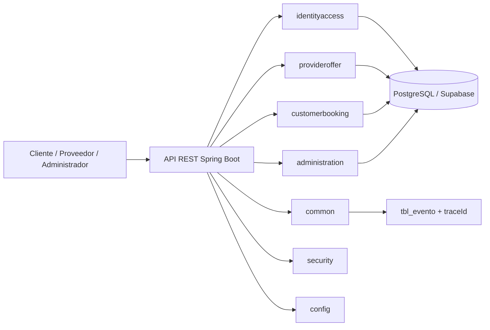
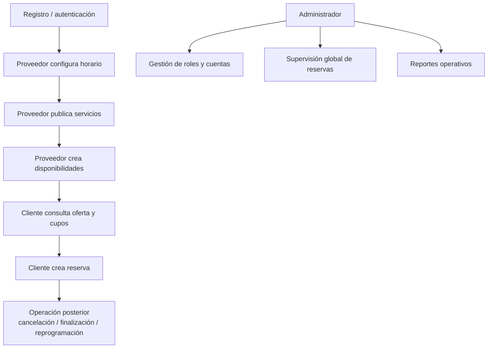
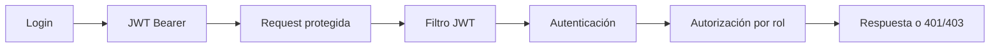
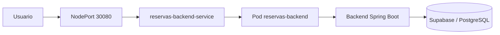
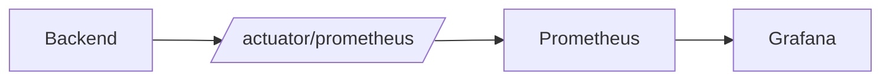

<h1 align="center">EAP09 · Caso 15 · Reservas de Servicios</h1>

<p align="center">
  Backend modular en Java 21 para reservas de servicios por agenda y cupos, con autenticación JWT, administración operativa, observabilidad y despliegue contenerizado.
</p>

<p align="center">
  
  
  
  
  
</p>

<p align="center">
  
  
  
  
  
</p>

<p align="center">
  
  
  
</p>

<p align="center">
  Estado real del backend al cierre de Sprint 3, con la base transaccional de Sprint 1, la operación de Sprint 2 y el gobierno administrativo y analítico de Sprint 3 integrados en una sola evolución del producto.
</p>

> [!NOTE]
> Documentación principal del proyecto:
>
> - [API REST consolidada](docs/api/README.md)
> - [Sprint 1 · APIs priorizadas](docs/api/sprint-1/README.md)
> - [Sprint 2 · APIs priorizadas](docs/api/sprint-2/README.md)
> - [Endpoints auxiliares](docs/api/auxiliares/README.md)
> - [Recursos comunes y contratos](docs/api/recursos/README.md)

> [!IMPORTANT]
> Este README resume el estado completo del repositorio. Sprint 3 no reemplaza la historia anterior: se integra sobre Sprint 1 y Sprint 2 para mostrar la evolución funcional y técnica del backend.

> [!TIP]
> Si llegas por primera vez, empieza por la visión general, sigue con la arquitectura y revisa después las secciones de APIs, seguridad, base de datos, calidad y despliegue.

## Índice

- [Visión general](#vision-general)
- [Estado actual](#estado-actual)
- [Arquitectura general](#arquitectura-general)
- [Flujo funcional](#flujo-funcional)
- [Historias por sprint](#historias-por-sprint)
- [APIs principales](#apis-principales)
- [Seguridad](#seguridad)
- [Base de datos](#base-de-datos)
- [Calidad y pruebas](#calidad-y-pruebas)
- [Docker](#docker)
- [Kubernetes](#kubernetes)
- [Observabilidad](#observabilidad)
- [CI/CD](#cicd)
- [Ejecución local](#ejecucion-local)
- [Kubernetes local](#kubernetes-local)
- [Swagger / OpenAPI](#swagger--openapi)
- [Documentación adicional](#documentacion-adicional)
- [Equipo](#equipo)
- [Estado final](#estado-final)

---

## Visión general

El proyecto **Reservas de Servicios** resuelve el ciclo completo de una plataforma de reservas: registro, autenticación, publicación de oferta, consulta de cupos, creación de reservas, operación posterior, supervisión administrativa y generación de reportes. El backend está diseñado para sostener reglas de negocio claras, trazabilidad funcional y una operación técnica realista sobre PostgreSQL.

### Actores principales

| Actor | Responsabilidad |
|---|---|
| `CLIENTE` | Consulta oferta, revisa cupos, crea reservas, cancela, reprograma y consulta su historial. |
| `PROVEEDOR` | Configura horario general, publica servicios, gestiona disponibilidades y opera reservas propias. |
| `ADMINISTRADOR` | Gestiona roles y estados de cuentas, supervisa reservas globales y genera reportes operativos. |

### Resumen ejecutivo

- Backend modular en capas con una sola unidad desplegable.
- Seguridad stateless con JWT y autorización por rol.
- Persistencia con PostgreSQL y Flyway.
- Documentación API con Swagger / OpenAPI.
- Contenedorización con Docker multi-stage.
- Despliegue Kubernetes con `NodePort` y probes de salud.
- Observabilidad con Actuator, Micrometer Prometheus y validación operativa con PromQL.
- Calidad controlada con JUnit, Spring Security Test, JaCoCo y SonarCloud.

---

## Estado actual

| Aspecto | Estado |
|---|---|
| Lenguaje | Java 21 |
| Framework | Spring Boot 3.3.4 |
| Build | Maven |
| Persistencia | PostgreSQL / Supabase |
| Migraciones | Flyway hasta `V8__seed_hu21_operational_report.sql` |
| Seguridad | JWT Bearer + Spring Security |
| API | `/api/v1` + Swagger / OpenAPI |
| Contenedores | Docker multi-stage |
| Kubernetes | Namespace `reservas`, Service `reservas-backend-service`, `NodePort 30080` |
| Observabilidad | Actuator + Micrometer Prometheus |
| Calidad | JaCoCo + SonarCloud + pruebas automatizadas |

### Evidencias recientes

- Validación local final: `mvn verify -B --no-transfer-progress`
- Resultado observado: `Tests run: 354, Failures: 0, Errors: 0, Skipped: 0`
- JaCoCo generado correctamente durante `verify` y `mvn test jacoco:report`
- Remediación SonarCloud documentada sin tocar código productivo

### Estado operativo documentado

| Componente | Valor |
|---|---|
| Workflow principal | `.github/workflows/CI-CD.yaml` |
| Imagen Docker para K8s | `reservas-backend:sprint3-obs` |
| Puerto del backend | `8080` |
| Service Kubernetes | `reservas-backend-service` |
| Namespace app | `reservas` |
| Namespace observabilidad | `monitoring` |
| Endpoint público de verificación | `/api/v1/public/status` |
| Endpoint de métricas | `/actuator/prometheus` |

---

## Arquitectura general

El proyecto sigue un **monolito modular en capas**. La separación por contexto funcional evita mezclar responsabilidades y permite que cada sprint agregue capacidades sobre una base estable.

### Módulos reales

| Módulo | Responsabilidad |
|---|---|
| `identityaccess` | Registro de cliente y proveedor, autenticación, cierre de sesión y perfil propio. |
| `provideroffer` | Horario general, servicios, estado de servicios y disponibilidades. |
| `customerbooking` | Consulta de oferta, cupos y reservas; creación, cancelación, finalización y reprogramación. |
| `administration` | Gestión de roles, estados de cuentas, supervisión de reservas y reportes operativos. |
| `common` | Respuestas uniformes, errores, trazabilidad, auditoría y utilitarios compartidos. |
| `security` | JWT, filtro de autenticación, handlers HTTP de seguridad y usuario principal. |
| `config` | CORS, OpenAPI, zona horaria y rutas base. |

### Capas por módulo

| Capa | Propósito |
|---|---|
| `api` | Controladores y DTOs HTTP. |
| `application` | Casos de uso y reglas de negocio. |
| `domain` | Entidades del dominio. |
| `infrastructure` | Repositorios, proyecciones y adaptadores de persistencia. |

### Diagrama modular


```mermaid
flowchart LR
    U[Cliente / Proveedor / Administrador] --> API[API REST Spring Boot]
    API --> IA[identityaccess]
    API --> PO[provideroffer]
    API --> CB[customerbooking]
    API --> AD[administration]
    API --> CM[common]
    API --> SE[security]
    API --> CF[config]
    IA --> DB[(PostgreSQL / Supabase)]
    PO --> DB
    CB --> DB
    AD --> DB
    CM --> EV[tbl_evento + traceId]
```

---

## Flujo funcional


```mermaid
flowchart TD
    A[Registro / autenticación] --> B[Proveedor configura horario]
    B --> C[Proveedor publica servicios]
    C --> D[Proveedor crea disponibilidades]
    D --> E[Cliente consulta oferta y cupos]
    E --> F[Cliente crea reserva]
    F --> G[Operación posterior<br/>cancelación / finalización / reprogramación]
    H[Administrador] --> I[Gestión de roles y cuentas]
    H --> J[Supervisión global de reservas]
    H --> K[Reportes operativos]
```

### Decisiones funcionales consolidadas

- El proveedor nace en estado `ACTIVA`.
- La disponibilidad se modela como franja concreta con fecha real.
- La reserva nace en estado `CREADA`.
- La capacidad restante se calcula a partir del dominio, no como dato duplicado.
- La reprogramación conserva la misma reserva y cambia la disponibilidad asociada.
- Las consultas administrativas son de solo lectura.

---

## Historias por sprint

### Sprint 1

Este sprint construyó la base transaccional del producto: registro, autenticación, oferta del proveedor, consulta de cupos y creación de reservas.

| HU | Actor | Propósito | Endpoint principal | Estado | Documento relacionado |
|---|---|---|---|---|---|
| HU-01 | Cliente | Registrar cuenta de cliente | `POST /api/v1/clients` | Implementado | [Sprint 1](docs/api/sprint-1/README.md) |
| HU-02 | Proveedor | Registrar cuenta de proveedor | `POST /api/v1/providers` | Implementado | [Sprint 1](docs/api/sprint-1/README.md) |
| HU-03 | Usuario | Autenticarse y obtener JWT | `POST /api/v1/auth/sessions` | Implementado | [Sprint 1](docs/api/sprint-1/README.md) |
| HU-08 | Proveedor | Definir horario general semanal | `PUT /api/v1/providers/me/general-schedule/{dayOfWeek}` | Implementado | [Sprint 1](docs/api/sprint-1/README.md) |
| HU-09 | Proveedor | Registrar un servicio propio | `POST /api/v1/providers/me/services` | Implementado | [Sprint 1](docs/api/sprint-1/README.md) |
| HU-11 | Proveedor | Crear y bloquear disponibilidades | `POST /api/v1/providers/me/services/{serviceId}/availabilities` | Implementado | [Sprint 1](docs/api/sprint-1/README.md) |
| HU-14 | Cliente | Consultar oferta disponible | `GET /api/v1/offers` | Implementado | [Sprint 1](docs/api/sprint-1/README.md) |
| HU-15 | Cliente | Consultar horarios y cupos | `GET /api/v1/providers/{providerId}/services/{serviceId}/availabilities?date=YYYY-MM-DD` | Implementado | [Sprint 1](docs/api/sprint-1/README.md) |
| HU-16 | Cliente | Crear una reserva | `POST /api/v1/bookings` | Implementado | [Sprint 1](docs/api/sprint-1/README.md) |

<details>
<summary><strong>Resumen funcional de Sprint 1</strong></summary>

- Forma la primera versión operable del sistema.
- Deja definidos los actores iniciales y la lógica de oferta.
- Sienta la base para la seguridad y la trazabilidad posterior.

</details>

### Sprint 2

Este sprint amplió la operación posterior y la autogestión: sesión segura, perfil, estado de servicios, consulta operativa y ciclo de vida de reservas.

| HU | Actor | Propósito | Endpoint principal | Estado | Documento relacionado |
|---|---|---|---|---|---|
| HU-04 | Usuario autenticado | Cerrar sesión segura | `DELETE /api/v1/auth/sessions/current` | Implementado | [Sprint 2](docs/api/sprint-2/README.md) |
| HU-05 | Usuario autenticado | Actualizar perfil propio | `PATCH /api/v1/users/me/profile` | Implementado | [Sprint 2](docs/api/sprint-2/README.md) |
| HU-10 | Proveedor | Activar o inactivar servicio propio | `PATCH /api/v1/providers/me/services/{serviceId}/status` | Implementado | [Sprint 2](docs/api/sprint-2/README.md) |
| HU-12 | Proveedor | Consultar reservas del proveedor | `GET /api/v1/providers/me/bookings` | Implementado | [Sprint 2](docs/api/sprint-2/README.md) |
| HU-13 | Proveedor | Finalizar reserva atendida | `PATCH /api/v1/providers/me/bookings/{bookingId}/finalization` | Implementado | [Sprint 2](docs/api/sprint-2/README.md) |
| HU-17 | Cliente | Cancelar reserva propia | `PATCH /api/v1/bookings/{bookingId}/cancellation` | Implementado | [Sprint 2](docs/api/sprint-2/README.md) |
| HU-19 | Cliente | Consultar historial propio | `GET /api/v1/bookings/me` | Implementado | [Sprint 2](docs/api/sprint-2/README.md) |

<details>
<summary><strong>Resumen funcional de Sprint 2</strong></summary>

- Consolida el uso real de la plataforma después de la creación de reservas.
- Refuerza la autogestión de usuarios y proveedores.
- Mantiene la arquitectura base mientras amplía el comportamiento operativo.

</details>

### Sprint 3

Sprint 3 añadió gobierno administrativo, reprogramación manual y analítica global sobre reservas.

| HU | Actor | Propósito | Endpoint principal | Estado | Documento relacionado |
|---|---|---|---|---|---|
| HU-06 | Administrador | Gestionar roles de usuario | `PATCH /api/v1/admin/users/{userId}/role` | Validado | [Validación HU-06](docs/sprint-3/hu-06-validacion-final.md) |
| HU-07 | Administrador | Activar o inactivar cuentas | `PATCH /api/v1/admin/users/{userId}/status` | Validado | [Validación HU-07](docs/sprint-3/hu-07-validacion-final.md) |
| HU-18 | Cliente | Reprogramar una reserva activa | `PATCH /api/v1/bookings/{bookingId}/reschedule` | Validado | [Validación HU-18](docs/sprint-3/hu-18-validacion-final.md) |
| HU-20 | Administrador | Supervisar reservas globales | `GET /api/v1/admin/bookings` | Validado | [Validación HU-20](docs/sprint-3/hu-20-validacion-final.md) |
| HU-21 | Administrador | Generar reportes operativos | `GET /api/v1/admin/reports/operational` | Validado | [Validación HU-21](docs/sprint-3/hu-21-validacion-final.md) |

<details>
<summary><strong>Resumen funcional de Sprint 3</strong></summary>

- Agrega control administrativo real sobre usuarios y reservas.
- Introduce reprogramación manual con reglas de negocio claras.
- Cierra el ciclo con reportes operativos y auditoría funcional.

</details>

---

## APIs principales

La documentación completa de rutas y ejemplos vive en [docs/api/README.md](docs/api/README.md). Aquí queda el mapa principal por dominio, con las rutas reales observadas en el código y en la documentación técnica del repositorio.

<details>
<summary><strong>Identidad y acceso</strong></summary>

| Método | Ruta | Actor / Rol | Descripción | Seguridad |
|---|---|---|---|---|
| `POST` | `/api/v1/clients` | Público | Registrar cliente | Pública |
| `POST` | `/api/v1/providers` | Público | Registrar proveedor | Pública |
| `POST` | `/api/v1/auth/sessions` | Público | Autenticar y emitir JWT | Pública |
| `DELETE` | `/api/v1/auth/sessions/current` | Usuario autenticado | Cerrar sesión vigente | JWT |
| `PATCH` | `/api/v1/users/me/profile` | Usuario autenticado | Actualizar perfil propio | JWT |

</details>

<details>
<summary><strong>Oferta del proveedor</strong></summary>

| Método | Ruta | Actor / Rol | Descripción | Seguridad |
|---|---|---|---|---|
| `PUT` | `/api/v1/providers/me/general-schedule/{dayOfWeek}` | `PROVEEDOR` | Definir o reemplazar horario general | JWT + rol |
| `POST` | `/api/v1/providers/me/services` | `PROVEEDOR` | Registrar servicio propio | JWT + rol |
| `PATCH` | `/api/v1/providers/me/services/{serviceId}/status` | `PROVEEDOR` | Activar o inactivar servicio | JWT + rol |
| `POST` | `/api/v1/providers/me/services/{serviceId}/availabilities` | `PROVEEDOR` | Crear disponibilidad | JWT + rol |
| `PATCH` | `/api/v1/providers/me/services/{serviceId}/availabilities/{availabilityId}/block` | `PROVEEDOR` | Bloquear disponibilidad | JWT + rol |

</details>

<details>
<summary><strong>Reservas del cliente y del proveedor</strong></summary>

| Método | Ruta | Actor / Rol | Descripción | Seguridad |
|---|---|---|---|---|
| `GET` | `/api/v1/offers` | `CLIENTE` | Consultar oferta disponible | JWT + rol |
| `GET` | `/api/v1/providers/{providerId}/services/{serviceId}/availabilities?date=YYYY-MM-DD` | `CLIENTE` | Consultar horarios y cupos reales | JWT + rol |
| `POST` | `/api/v1/bookings` | `CLIENTE` | Crear reserva | JWT + rol |
| `PATCH` | `/api/v1/bookings/{bookingId}/cancellation` | `CLIENTE` | Cancelar reserva propia | JWT + rol |
| `PATCH` | `/api/v1/bookings/{bookingId}/reschedule` | `CLIENTE` | Reprogramar reserva propia | JWT + rol |
| `GET` | `/api/v1/bookings/me` | `CLIENTE` | Consultar historial propio | JWT + rol |
| `GET` | `/api/v1/providers/me/bookings` | `PROVEEDOR` | Consultar reservas operativas | JWT + rol |
| `PATCH` | `/api/v1/providers/me/bookings/{bookingId}/finalization` | `PROVEEDOR` | Finalizar reserva atendida | JWT + rol |

</details>

<details>
<summary><strong>Administración</strong></summary>

| Método | Ruta | Actor / Rol | Descripción | Seguridad |
|---|---|---|---|---|
| `PATCH` | `/api/v1/admin/users/{userId}/role` | `ADMINISTRADOR` | Cambiar rol de usuario | JWT + rol |
| `PATCH` | `/api/v1/admin/users/{userId}/status` | `ADMINISTRADOR` | Activar o inactivar cuenta | JWT + rol |
| `GET` | `/api/v1/admin/bookings` | `ADMINISTRADOR` | Supervisar reservas globales | JWT + rol |
| `GET` | `/api/v1/admin/reports/operational` | `ADMINISTRADOR` | Generar reporte operativo | JWT + rol |

</details>

<details>
<summary><strong>Endpoints auxiliares</strong></summary>

| Método | Ruta | Seguridad | Propósito |
|---|---|---|---|
| `GET` | `/api/v1/public/status` | Pública | Estado público del backend |
| `GET` | `/api/v1/protected/status` | JWT | Estado protegido con usuario autenticado |
| `GET` | `/api/v1/auth/bootstrap` | Pública | Bootstrap del módulo de identidad |
| `GET` | `/api/v1/protected/customer-booking/bootstrap` | JWT | Bootstrap del módulo de reservas |
| `GET` | `/api/v1/protected/provider-offer/bootstrap` | JWT | Bootstrap del módulo de oferta |

</details>

---

## Seguridad

La seguridad está implementada con Spring Security en modo stateless, autenticación JWT Bearer y autorización por rol. El filtro JWT se ejecuta antes de `UsernamePasswordAuthenticationFilter`, y las respuestas HTTP de error se manejan con handlers dedicados para `401` y `403`.

### Puntos clave

- `SessionCreationPolicy.STATELESS`.
- Contraseñas con BCrypt.
- Esquema `bearerAuth` documentado en OpenAPI.
- Rutas públicas limitadas a registro, login, bootstrap, `swagger-ui` y health/metrics permitidos.
- Operaciones propias bajo rutas `/me`.
- Operaciones administrativas bajo `/api/v1/admin/**`.
- Validación manual de propiedad del recurso cuando corresponde.

### Roles del sistema

| Rol | Uso principal |
|---|---|
| `CLIENTE` | Oferta, reservas propias y operación sobre su historial. |
| `PROVEEDOR` | Oferta, disponibilidades y reservas asociadas a su servicio. |
| `ADMINISTRADOR` | Gestión de usuarios, supervisión global y reportes. |

### Comportamiento esperado

- Sin token: `401 Unauthorized`.
- Token válido y rol correcto: acceso permitido.
- Token válido con rol incorrecto: `403 Forbidden`.

### Flujo JWT


```mermaid
flowchart LR
    A[Login] --> B[JWT Bearer]
    B --> C[Request protegida]
    C --> D[Filtro JWT]
    D --> E[Autenticación]
    E --> F[Autorización por rol]
    F --> G[Respuesta o 401/403]
```

---

## Base de datos

El backend usa PostgreSQL como base transaccional, con el entorno de trabajo documentado sobre Supabase. Flyway gestiona las migraciones al arranque y mantiene el esquema alineado con el estado funcional del proyecto.

### Migraciones principales

| Versión | Archivo | Propósito |
|---|---|---|
| `V1` | `V1__schema_reset.sql` | Reset del esquema base. |
| `V2` | `V2__seed_catalogos.sql` | Carga de catálogos iniciales. |
| `V3` | `V3__seed_operativo_sprint2.sql` | Seed operativo de Sprint 2. |
| `V4` | `V4__seed_hu06_user_role_management.sql` | Semilla para gestión de roles. |
| `V5` | `V5__seed_hu07_user_account_status_management.sql` | Semilla para activación e inactivación de cuentas. |
| `V6` | `V6__seed_hu18_reservation_rescheduling.sql` | Semilla para reprogramación de reservas. |
| `V7` | `V7__seed_hu20_admin_reservation_supervision.sql` | Semilla para supervisión administrativa de reservas. |
| `V8` | `V8__seed_hu21_operational_report.sql` | Semilla para reporte operativo global. |

### Entidades y tablas destacadas

| Dominio | Tablas relevantes |
|---|---|
| Usuarios y roles | `tbl_usuario`, `tbl_rol` |
| Estados | `tbl_categoria_estado`, `tbl_estado` |
| Oferta del proveedor | `tbl_horario_general_proveedor`, `tbl_dia_semana`, `tbl_servicio`, `tbl_disponibilidad_servicio` |
| Reservas | `tbl_reserva` |
| Auditoría y trazabilidad | `tbl_evento`, `tbl_tipo_evento`, `tbl_tipo_registro` |

### Estados funcionales observados

| Entidad | Estados principales |
|---|---|
| `tbl_usuario` | `ACTIVA`, `INACTIVA` |
| `tbl_servicio` | `ACTIVO`, `INACTIVO` |
| `tbl_disponibilidad_servicio` | `HABILITADA`, `BLOQUEADA` |
| `tbl_reserva` | `CREADA`, `CANCELADA`, `FINALIZADA` |

### Auditoría funcional

El backend registra eventos de negocio para trazabilidad, incluyendo registro de usuarios, autenticación, configuración de oferta, creación de reservas, reprogramación y acciones administrativas. El contrato de respuestas conserva `traceId` para correlación.

---

## Calidad y pruebas

El proyecto está cubierto con Maven, JUnit 5, Spring Security Test, MockMvc, pruebas de aplicación y de controlador, más JaCoCo para cobertura y SonarCloud para calidad.

### Evidencia reciente

- `mvn verify -B --no-transfer-progress`
- `Tests run: 354, Failures: 0, Errors: 0, Skipped: 0`
- `BUILD SUCCESS`
- JaCoCo generado correctamente

### Herramientas observadas

| Herramienta | Uso |
|---|---|
| Maven | Compilación, pruebas y empaquetado |
| JUnit 5 | Pruebas unitarias y de integración |
| Spring Security Test | Validación de autenticación y autorización |
| JaCoCo | Cobertura local |
| SonarCloud | Calidad y remediación de issues |

### Suites representativas

```bash
mvn test
mvn clean test -B --no-transfer-progress
mvn verify -B --no-transfer-progress
mvn test jacoco:report
```

### Validación SonarCloud

- Remediación documentada en [docs/sprint-3/sonarcloud-remediacion-issues-actuales.md](docs/sprint-3/sonarcloud-remediacion-issues-actuales.md)
- Refactor de handler documentado en [docs/sonar-java-s6539-exception-handler-refactor-report.md](docs/sonar-java-s6539-exception-handler-refactor-report.md)
- Calidad adicional documentada en [docs/sonarcloud-quality-gate-remediation-report.md](docs/sonarcloud-quality-gate-remediation-report.md)

---

## Docker

El repositorio incluye un Dockerfile multi-stage. La etapa de build usa Maven sobre Temurin 21 y la etapa final ejecuta el JRE mínimo de Eclipse Temurin 21.

### Lo que hace el Dockerfile

- Resuelve dependencias con Maven.
- Compila el artefacto Spring Boot.
- Copia el JAR final a una imagen runtime mínima.
- Expone el puerto `8080`.

### Imagen usada en el proyecto

- `reservas-backend:sprint3-obs`

### Comandos útiles

```bash
docker build -t reservas-backend:sprint3-obs .
docker images reservas-backend
```

---

## Kubernetes

Los manifiestos en `k8s/` definen el despliegue del backend dentro del namespace `reservas`.

### Lo que está definido

| Elemento | Valor |
|---|---|
| Namespace | `reservas` |
| ConfigMap | `reservas-backend-config` |
| Secret esperado por el deployment | `reservas-backend-secret` |
| Deployment | `reservas-backend` |
| Service | `reservas-backend-service` |
| Tipo de Service | `NodePort` |
| Puerto del Service | `8080` |
| NodePort | `30080` |
| Imagen del contenedor | `reservas-backend:sprint3-obs` |

### Probes

El deployment usa `readinessProbe` y `livenessProbe` sobre `/api/v1/public/status`.

### Anotaciones de monitoreo

El service está anotado para scraping de Prometheus:

- `prometheus.io/scrape: "true"`
- `prometheus.io/path: "/actuator/prometheus"`
- `prometheus.io/port: "8080"`

### Comandos útiles

```bash
kubectl apply -f k8s/namespace-configmap.yaml
kubectl apply -f k8s/deployment-service.yaml
kubectl get deployments,pods,svc -n reservas
```

### Diagrama de despliegue


```mermaid
flowchart LR
    U[Usuario] --> NP[NodePort 30080]
    NP --> SVC[reservas-backend-service]
    SVC --> POD[Pod reservas-backend]
    POD --> BE[Backend Spring Boot]
    BE --> DB[(Supabase / PostgreSQL)]
```

---

## Observabilidad

La observabilidad del proyecto se apoya en Spring Boot Actuator y Micrometer Prometheus. El backend expone métricas en `/actuator/prometheus` y mantiene los endpoints de salud y métricas habilitados desde configuración.

### Lo que está documentado y validado

- Actuator expone `health`, `info`, `metrics` y `prometheus`.
- El service del backend está preparado para scrapeo por Prometheus.
- El namespace de observabilidad es `monitoring`.
- Grafana consume Prometheus como datasource en el entorno del proyecto.
- La consulta PromQL validada fue:

```promql
up{namespace="reservas",service="reservas-backend-service"}
```

- Resultado esperado: `1`

### Flujo de observabilidad


```mermaid
flowchart LR
    BE[Backend] --> A[/actuator/prometheus/]
    A --> P[Prometheus]
    P --> G[Grafana]
```

---

## CI/CD

El workflow [`.github/workflows/CI-CD.yaml`](.github/workflows/CI-CD.yaml) se activa en `push` a `main`, `push` a `dev` y `pull_request` hacia `main`.

### Lo que realmente hace el workflow

1. Hace checkout del código.
2. Configura Java 21 con Temurin.
3. Ejecuta `mvn clean verify sonar:sonar`.
4. Publica análisis en SonarCloud.
5. Define el nombre lógico de la imagen según la rama.
6. Hace login en Azure Container Registry.
7. Construye y publica la imagen Docker con SHA y `latest`.

> [!NOTE]
> En el workflow revisado no aparece una etapa automática de despliegue final a Azure Container Apps. El pipeline deja la imagen lista para publicación y análisis de calidad.

---

## Ejecución local

### Prerrequisitos

- Java 21
- Maven 3.9+
- PostgreSQL accesible o entorno equivalente
- Docker si se desea construir la imagen
- `kubectl` y `minikube` si se quiere validar Kubernetes localmente

### Variables de entorno

Usa nombres de variables, no valores reales:

- `DB_URL`
- `DB_USERNAME`
- `DB_PASSWORD`
- `JWT_SECRET`
- `JWT_EXPIRATION_SECONDS`
- `CORS_ALLOWED_ORIGINS`
- `USER_ACTIVE_STATE_ID`

### Arranque local

```bash
mvn spring-boot:run
```

### Validación local

```bash
mvn verify -B --no-transfer-progress
```

---

## Kubernetes local

### Flujo resumido

```bash
minikube start --driver=docker
docker build -t reservas-backend:sprint3-obs .
minikube image load reservas-backend:sprint3-obs
kubectl apply -f k8s/namespace-configmap.yaml
kubectl apply -f k8s/deployment-service.yaml
kubectl get deployments,pods,svc -n reservas
minikube service reservas-backend-service -n reservas --url
```

> [!TIP]
> En Windows, `minikube service ... --url` puede dejar una sesión de túnel activa mientras el servicio esté expuesto.

---

## Swagger / OpenAPI

La documentación interactiva está disponible en:

- `/swagger-ui/index.html`
- `/swagger-ui.html`
- `/v3/api-docs`

### Lo que ofrece Swagger

- Exploración de endpoints por módulo.
- Botón `Authorize` para enviar el JWT Bearer.
- Contratos y ejemplos alineados con los controladores del backend.

---

## Documentación adicional

### APIs y contratos

- [docs/api/README.md](docs/api/README.md)
- [docs/api/sprint-1/README.md](docs/api/sprint-1/README.md)
- [docs/api/sprint-2/README.md](docs/api/sprint-2/README.md)
- [docs/api/auxiliares/README.md](docs/api/auxiliares/README.md)
- [docs/api/recursos/README.md](docs/api/recursos/README.md)

### Sprint 3

- [HU-06 diagnóstico](docs/sprint-3/hu-06-gestion-roles-diagnostico.md)
- [HU-06 validación final](docs/sprint-3/hu-06-validacion-final.md)
- [HU-07 diagnóstico](docs/sprint-3/hu-07-activacion-inactivacion-cuentas-diagnostico.md)
- [HU-07 validación final](docs/sprint-3/hu-07-validacion-final.md)
- [HU-18 diagnóstico](docs/sprint-3/hu-18-reprogramacion-manual-reserva-diagnostico.md)
- [HU-18 validación final](docs/sprint-3/hu-18-validacion-final.md)
- [HU-20 diagnóstico](docs/sprint-3/hu-20-supervision-administrativa-reservas-diagnostico.md)
- [HU-20 validación final](docs/sprint-3/hu-20-validacion-final.md)
- [HU-21 diagnóstico](docs/sprint-3/hu-21-reportes-operativos-globales-diagnostico.md)
- [HU-21 validación final](docs/sprint-3/hu-21-validacion-final.md)

### Calidad

- [Remediación actual de SonarCloud](docs/sprint-3/sonarcloud-remediacion-issues-actuales.md)
- [Quality gate remediation report](docs/sonarcloud-quality-gate-remediation-report.md)
- [Refactor de handler por S6539](docs/sonar-java-s6539-exception-handler-refactor-report.md)

---

## Equipo

**EAP09**

Caso 15 - Plataforma backend para reservas de servicios por agenda y cupos.

Si el equipo desea completar este bloque para sustentación o entrega final, puede agregar aquí integrantes, roles y enlaces internos del proyecto sin modificar el resto de la documentación.

---

## Estado final

El backend queda documentado como un sistema funcional y cohesionado, con APIs principales descritas, seguridad JWT aplicada, base de datos migrada con Flyway, contenedorización Docker, despliegue Kubernetes, observabilidad Prometheus/Grafana y validaciones automáticas en verde.

La versión actual del proyecto representa la consolidación de Sprint 1, Sprint 2 y Sprint 3 como una sola narrativa técnica y funcional, lista para GitHub como documento principal del repositorio.
