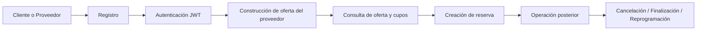
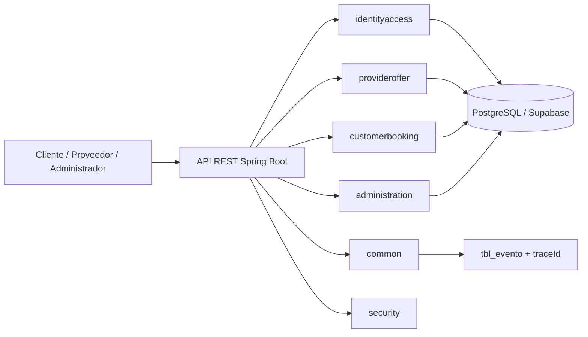
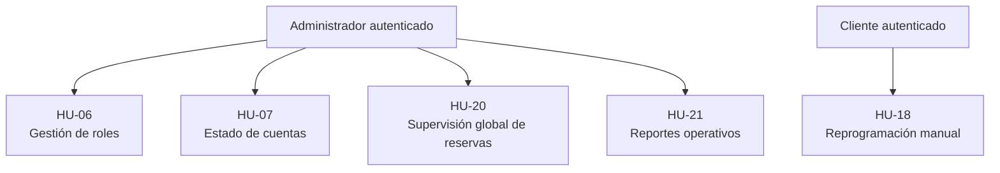
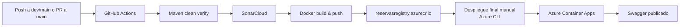

# EAP09 | Caso 15 | Reservas de Servicios - Backend

<p align="left">
  
  
  
  
  
  
  
  
  
  
</p>

Backend del equipo **EAP09** para el **Caso 15**, orientado a una plataforma de reservas de servicios por agenda y cupos. Este README documenta el **estado real implementado, validado y desplegado al cierre de Sprint 3**, conservando el recorrido funcional de Sprint 1 y Sprint 2 y agregando la capa administrativa global incorporada en la iteración más reciente.

> [!NOTE]
> Documentación interactiva principal:
>
> - Producción: <https://reservas-backend-prod.happypond-328540f7.eastus.azurecontainerapps.io/swagger-ui/index.html>
> - Local: `http://localhost:8080/swagger-ui/index.html`

> [!IMPORTANT]
> Este documento no expone credenciales, tokens, secretos ni valores sensibles. Todas las referencias de configuración se muestran de forma genérica.

<a id="indice"></a>
## Índice

- [Descripción general](#descripcion-general)
- [Estado actual del proyecto](#estado-actual-del-proyecto)
- [Arquitectura del sistema](#arquitectura-del-sistema)
- [Historias de usuario por sprint](#historias-de-usuario-por-sprint)
- [Sprint 3: administración y reportes](#sprint-3-administracion-y-reportes)
- [API REST y Swagger](#api-rest-y-swagger)
- [Seguridad](#seguridad)
- [Base de datos y persistencia](#base-de-datos-y-persistencia)
- [CI/CD y despliegue](#cicd-y-despliegue)
- [Calidad y pruebas](#calidad-y-pruebas)
- [Ejecución local](#ejecucion-local)
- [Postman y flujo de demo](#postman-y-flujo-de-demo)
- [Documentación adicional](#documentacion-adicional)
- [Equipo](#equipo)

---

<a id="descripcion-general"></a>
## Descripción general

La plataforma resuelve el problema de coordinar **clientes**, **proveedores** y **administradores** sobre una misma base transaccional, manteniendo reglas de negocio, trazabilidad y control de acceso alrededor de la reserva de servicios agendables.

### Actores principales

| Actor | Qué puede hacer |
|---|---|
| `CLIENTE` | Consultar oferta, ver horarios/cupos, crear reservas, cancelarlas, reprogramarlas y consultar su historial. |
| `PROVEEDOR` | Definir horario general, registrar servicios, activarlos/inactivarlos, gestionar disponibilidades y operar reservas propias. |
| `ADMINISTRADOR` | Gestionar roles, activar/inactivar cuentas, supervisar reservas globales y generar reportes operativos. |

### Qué permite hacer hoy el backend

- Registrar clientes y proveedores.
- Autenticar usuarios con JWT y cerrar sesión de forma segura.
- Mantener el perfil propio actualizado.
- Construir la oferta del proveedor con horario general, servicios y disponibilidades concretas.
- Consultar oferta disponible y cupos reales por fecha.
- Crear, cancelar, finalizar y reprogramar reservas bajo reglas de negocio.
- Gestionar administración global de usuarios y supervisión transversal de la plataforma.
- Generar reportes operativos globales sobre el historial de reservas.

### Flujo funcional principal


```mermaid
flowchart LR
    A[Cliente o Proveedor] --> B[Registro]
    B --> C[Autenticación JWT]
    C --> D[Construcción de oferta del proveedor]
    D --> E[Consulta de oferta y cupos]
    E --> F[Creación de reserva]
    F --> G[Operación posterior]
    G --> H[Cancelación / Finalización / Reprogramación]
```

<details>
<summary><strong>Decisiones funcionales consolidadas</strong></summary>

- El proveedor registrado nace en estado `ACTIVA`.
- El horario general del proveedor se modela como un único rango por día.
- La disponibilidad se modela como una franja concreta con fecha real.
- La reserva nace en estado `CREADA`.
- La capacidad restante se calcula; no se persiste como dato redundante.
- Un servicio puede pasar entre `ACTIVO` e `INACTIVO` sin invalidar reservas ya creadas.
- Una reserva `CREADA` puede pasar a `FINALIZADA` o `CANCELADA` según reglas temporales y de propiedad.
- La reprogramación de HU-18 mantiene la misma reserva y actualiza la franja asociada con trazabilidad funcional.
- Las consultas administrativas de HU-20 y HU-21 son de solo lectura.

</details>

---

<a id="estado-actual-del-proyecto"></a>
## Estado actual del proyecto

| Aspecto | Estado actual |
|---|---|
| Sprint 1 | Implementado y estabilizado |
| Sprint 2 | Implementado y estabilizado |
| Sprint 3 | Implementado y validado |
| Arquitectura | Monolito modular en capas |
| API | Publicada bajo `/api/v1` y documentada con OpenAPI/Swagger |
| Base de datos | PostgreSQL sobre Supabase |
| Migraciones | Flyway versionado hasta `V8__seed_hu21_operational_report.sql` |
| Calidad | SonarCloud integrado en CI y remediación reciente documentada |
| Cobertura | Validada con JaCoCo y reporte generado en la última secuencia de build |
| Contenedorización | Docker multi-stage |
| Despliegue | Azure Container Registry + Azure Container Apps |

### Resumen ejecutivo por sprint

- **Sprint 1**: base transaccional del producto, publicación de oferta y flujo de reserva inicial.
- **Sprint 2**: operación posterior sobre sesiones, perfil, servicios y reservas.
- **Sprint 3**: administración global de usuarios, reprogramación manual, supervisión administrativa y reportes operativos.

### Estado operativo y de despliegue

| Componente | Valor actual |
|---|---|
| Repositorio | GitHub |
| Ramas principales | `main`, `dev` |
| Workflow principal | `.github/workflows/CI-CD.yaml` |
| Registry | `reservasregistry.azurecr.io` |
| Imágenes | `reservas-backend-prod`, `reservas-backend-dev` |
| Azure Container Apps | `reservas-backend-prod`, `reservas-backend-dev` |
| Environment | `reservas-env` |
| Región | `East US` |
| Puerto expuesto | `8080` |
| Swagger en producción | <https://reservas-backend-prod.happypond-328540f7.eastus.azurecontainerapps.io/swagger-ui/index.html> |

### Validación reciente

La última secuencia de validación ejecutada sobre este workspace dejó en verde:

- `mvn clean test -B --no-transfer-progress`
- `mvn verify -B --no-transfer-progress`
- `mvn test jacoco:report`

Resultado más reciente observado: **354 tests, 0 fallos, 0 errores, 0 omitidos**, con `BUILD SUCCESS` y reporte JaCoCo generado.

---

<a id="arquitectura-del-sistema"></a>
## Arquitectura del sistema

### Estilo arquitectónico

**Monolito modular en capas** con separación por contexto funcional y utilitarios transversales. La arquitectura evita sobrefragmentación temprana, mantiene una sola unidad desplegable y deja el dominio organizado por módulos claros.

### Módulos principales

| Módulo | Responsabilidad principal |
|---|---|
| `identityaccess` | Registro, autenticación, cierre de sesión y perfil de usuario. |
| `provideroffer` | Horario general, servicios, activación/inactivación y disponibilidades del proveedor. |
| `customerbooking` | Oferta, horarios/cupos, creación de reserva, cancelación, finalización y reprogramación. |
| `administration` | Gestión global de roles, cuentas, supervisión de reservas y reportes operativos. |
| `common` | Respuestas uniformes, trazabilidad, auditoría, excepciones, utilitarios y endpoints base. |
| `security` | JWT, filtros, configuración HTTP stateless y soporte de autenticación. |

### Capas por módulo

| Capa | Propósito |
|---|---|
| `api` | Controllers y DTOs expuestos por HTTP. |
| `application` | Casos de uso y reglas de negocio. |
| `domain` | Entidades y modelo del dominio. |
| `infrastructure` | Repositorios, consultas y adaptadores de persistencia. |

### Diagrama de arquitectura modular


```mermaid
flowchart LR
    Client[Cliente / Proveedor / Administrador] --> API[API REST Spring Boot]
    API --> IA[identityaccess]
    API --> PO[provideroffer]
    API --> CB[customerbooking]
    API --> AD[administration]
    API --> CM[common]
    API --> SE[security]
    IA --> DB[(PostgreSQL / Supabase)]
    PO --> DB
    CB --> DB
    AD --> DB
    CM --> EV[tbl_evento + traceId]
```

<details>
<summary><strong>Estructura útil del repositorio</strong></summary>

```text
.
├── .github/
│   └── workflows/
│       └── CI-CD.yaml
├── docs/
│   ├── api/
│   ├── sprint-3/
│   ├── sonar-java-s6539-exception-handler-refactor-report.md
│   └── sonarcloud-quality-gate-remediation-report.md
├── src/
│   ├── main/
│   │   ├── java/com/eap09/reservas/
│   │   │   ├── administration/
│   │   │   ├── common/
│   │   │   ├── config/
│   │   │   ├── customerbooking/
│   │   │   ├── identityaccess/
│   │   │   ├── provideroffer/
│   │   │   └── security/
│   │   └── resources/
│   │       ├── application.yml
│   │       ├── application-dev.yml
│   │       └── db/migration/
│   └── test/
│       └── java/
├── Dockerfile
├── pom.xml
└── README.md
```

</details>

---

<a id="historias-de-usuario-por-sprint"></a>
## Historias de usuario por sprint

### Sprint 1

| HU | Capacidad | Resultado funcional |
|---|---|---|
| HU-01 | Registro de cliente | Alta de cuenta cliente con validación y trazabilidad. |
| HU-02 | Registro de proveedor | Alta de cuenta proveedor con rol y estado inicial controlados. |
| HU-03 | Autenticación | Emisión de JWT y control de intentos fallidos. |
| HU-08 | Horario general | Configuración semanal del proveedor por día. |
| HU-09 | Registro de servicio | Publicación de servicios ofertables por proveedor. |
| HU-11 | Gestión de disponibilidad | Creación y bloqueo de franjas concretas por servicio. |
| HU-14 | Consulta de oferta | Exploración de servicios reservables para cliente. |
| HU-15 | Consulta de horarios/cupos | Consulta por proveedor, servicio y fecha con cupos reales. |
| HU-16 | Creación de reserva | Reserva transaccional válida sobre una franja habilitada. |

### Sprint 2

| HU | Capacidad | Resultado funcional |
|---|---|---|
| HU-04 | Cierre de sesión segura | Terminación controlada de la sesión JWT actual. |
| HU-05 | Actualización de perfil | Mantenimiento del perfil propio con validación y trazabilidad. |
| HU-10 | Estado de servicio | Activación e inactivación de servicios propios. |
| HU-12 | Consulta de reservas del proveedor | Vista operativa de reservas asociadas a servicios propios. |
| HU-13 | Finalización de reservas | Cierre operativo de reservas atendidas. |
| HU-17 | Cancelación de reserva | Cancelación de reserva futura del cliente propietario. |
| HU-19 | Consulta de reservas del cliente | Trazabilidad del historial propio del cliente. |

### Sprint 3

| HU | Capacidad | Endpoint principal |
|---|---|---|
| HU-06 | Gestión de roles de usuario | `PATCH /api/v1/admin/users/{userId}/role` |
| HU-07 | Activación e inactivación de cuentas | `PATCH /api/v1/admin/users/{userId}/status` |
| HU-18 | Reprogramación manual de reserva | `PATCH /api/v1/bookings/{bookingId}/reschedule` |
| HU-20 | Supervisión administrativa de reservas | `GET /api/v1/admin/bookings` |
| HU-21 | Generación de reportes operativos globales | `GET /api/v1/admin/reports/operational` |

---

<a id="sprint-3-administracion-y-reportes"></a>
## Sprint 3: administración y reportes

Sprint 3 agrega una capa administrativa transversal y completa el ciclo funcional del backend con capacidades globales de gobierno, supervisión y analítica operativa.


```mermaid
flowchart TD
    Admin[Administrador autenticado] --> Roles[HU-06<br/>Gestión de roles]
    Admin --> Status[HU-07<br/>Estado de cuentas]
    Admin --> Supervision[HU-20<br/>Supervisión global de reservas]
    Admin --> Reports[HU-21<br/>Reportes operativos]
    Client[Cliente autenticado] --> Reschedule[HU-18<br/>Reprogramación manual]
```

### HU-06 · Gestión de roles de usuario

- **Actor**: `ADMINISTRADOR`
- **Endpoint principal**: `PATCH /api/v1/admin/users/{userId}/role`
- **Propósito**: actualizar el rol de una cuenta para controlar acceso a funcionalidades según su perfil.
- **Reglas clave**:
  - solo un administrador autenticado puede ejecutar el cambio;
  - la cuenta objetivo debe existir y estar activa;
  - no se permite reasignar el mismo rol;
  - la operación deja trazabilidad funcional.
- **Ejemplo de payload**:

```json
{
  "roleName": "PROVEEDOR"
}
```

- **Documentos relacionados**:
  - [Diagnóstico HU-06](docs/sprint-3/hu-06-gestion-roles-diagnostico.md)
  - [Validación final HU-06](docs/sprint-3/hu-06-validacion-final.md)

### HU-07 · Activación e inactivación de cuentas

- **Actor**: `ADMINISTRADOR`
- **Endpoint principal**: `PATCH /api/v1/admin/users/{userId}/status`
- **Propósito**: activar o inactivar usuarios sin alterar servicios o reservas ya existentes.
- **Reglas clave**:
  - activa cuentas inactivas e inactiva cuentas activas;
  - bloquea solicitudes redundantes;
  - conserva servicios y reservas sin mutación funcional;
  - mantiene auditoría del cambio administrativo.
- **Ejemplo de payload**:

```json
{
  "targetStatus": "INACTIVA"
}
```

- **Documentos relacionados**:
  - [Diagnóstico HU-07](docs/sprint-3/hu-07-activacion-inactivacion-cuentas-diagnostico.md)
  - [Validación final HU-07](docs/sprint-3/hu-07-validacion-final.md)

### HU-18 · Reprogramación manual de reserva

- **Actor**: `CLIENTE`
- **Endpoint principal**: `PATCH /api/v1/bookings/{bookingId}/reschedule`
- **Propósito**: mover una reserva activa hacia otra franja disponible sin perder identidad ni trazabilidad.
- **Reglas clave**:
  - la reserva debe pertenecer al cliente autenticado;
  - la reserva debe permanecer en estado `CREADA`;
  - no se permite reprogramar con menos de 24 horas de anticipación respecto al slot actual;
  - la nueva disponibilidad debe existir, estar habilitada, pertenecer al mismo servicio, ser futura y tener cupos.
- **Ejemplo de payload**:

```json
{
  "availabilityId": 42
}
```

- **Documentos relacionados**:
  - [Diagnóstico HU-18](docs/sprint-3/hu-18-reprogramacion-manual-reserva-diagnostico.md)
  - [Validación final HU-18](docs/sprint-3/hu-18-validacion-final.md)

### HU-20 · Supervisión administrativa de reservas

- **Actor**: `ADMINISTRADOR`
- **Endpoint principal**: `GET /api/v1/admin/bookings`
- **Propósito**: supervisar reservas activas e históricas en toda la plataforma.
- **Filtros soportados**: `customerId`, `providerId`, `serviceId`, `status`, `from`, `to`.
- **Reglas clave**:
  - acepta filtros combinados;
  - distingue entre “sin coincidencias” y “sin reservas registradas”;
  - es una consulta read-only;
  - mantiene trazabilidad funcional con auditoría.
- **Documentos relacionados**:
  - [Diagnóstico HU-20](docs/sprint-3/hu-20-supervision-administrativa-reservas-diagnostico.md)
  - [Validación final HU-20](docs/sprint-3/hu-20-validacion-final.md)

### HU-21 · Generación de reportes operativos globales

- **Actor**: `ADMINISTRADOR`
- **Endpoint principal**: `GET /api/v1/admin/reports/operational`
- **Filtros soportados**: `from`, `to`.
- **Propósito**: generar indicadores agregados de ocupación, uso y cancelaciones a partir del historial de reservas.
- **Incluye**:
  - conteos por estado;
  - agregados por servicio;
  - agregados por proveedor;
  - tasas operativas derivadas del historial disponible.
- **Reglas clave**:
  - responde error controlado si no existe historial suficiente para generar el reporte;
  - mantiene el patrón de solo lectura;
  - conserva auditoría administrativa.
- **Documentos relacionados**:
  - [Diagnóstico HU-21](docs/sprint-3/hu-21-reportes-operativos-globales-diagnostico.md)
  - [Validación final HU-21](docs/sprint-3/hu-21-validacion-final.md)

---

<a id="api-rest-y-swagger"></a>
## API REST y Swagger

### Convenciones generales

- Base path: `/api/v1`
- Estilo: REST con respuestas uniformes y trazabilidad por `traceId`
- Documentación OpenAPI local: `http://localhost:8080/v3/api-docs`
- Swagger UI local: `http://localhost:8080/swagger-ui/index.html`
- Swagger UI de producción: <https://reservas-backend-prod.happypond-328540f7.eastus.azurecontainerapps.io/swagger-ui/index.html>

### Endpoints principales por módulo

<details>
<summary><strong>Identity Access</strong></summary>

| Método | Ruta | Descripción | Auth |
|---|---|---|---|
| `POST` | `/api/v1/clients` | Registro de cliente | No |
| `POST` | `/api/v1/providers` | Registro de proveedor | No |
| `POST` | `/api/v1/auth/sessions` | Autenticación y emisión JWT | No |
| `DELETE` | `/api/v1/auth/sessions/current` | Cierre seguro de la sesión actual | Sí |
| `PATCH` | `/api/v1/users/me/profile` | Actualización del perfil propio | Sí |

</details>

<details>
<summary><strong>Provider Offer</strong></summary>

| Método | Ruta | Descripción | Rol esperado |
|---|---|---|---|
| `PUT` | `/api/v1/providers/me/general-schedule/{dayOfWeek}` | Definir o reemplazar horario general | `PROVEEDOR` |
| `POST` | `/api/v1/providers/me/services` | Registrar servicio propio | `PROVEEDOR` |
| `PATCH` | `/api/v1/providers/me/services/{serviceId}/status` | Activar o inactivar servicio propio | `PROVEEDOR` |
| `POST` | `/api/v1/providers/me/services/{serviceId}/availabilities` | Crear disponibilidad | `PROVEEDOR` |
| `PATCH` | `/api/v1/providers/me/services/{serviceId}/availabilities/{availabilityId}/block` | Bloquear disponibilidad | `PROVEEDOR` |

</details>

<details>
<summary><strong>Customer Booking y Reservation</strong></summary>

| Método | Ruta | Descripción | Rol esperado |
|---|---|---|---|
| `GET` | `/api/v1/offers` | Consultar oferta disponible | `CLIENTE` |
| `GET` | `/api/v1/providers/{providerId}/services/{serviceId}/availabilities?date=YYYY-MM-DD` | Consultar horarios y cupos | `CLIENTE` |
| `POST` | `/api/v1/bookings` | Crear reserva | `CLIENTE` |
| `PATCH` | `/api/v1/bookings/{bookingId}/cancellation` | Cancelar reserva propia | `CLIENTE` |
| `PATCH` | `/api/v1/bookings/{bookingId}/reschedule` | Reprogramar reserva propia | `CLIENTE` |
| `GET` | `/api/v1/bookings/me` | Consultar historial propio | `CLIENTE` |
| `GET` | `/api/v1/providers/me/bookings` | Consultar reservas del proveedor | `PROVEEDOR` |
| `PATCH` | `/api/v1/providers/me/bookings/{bookingId}/finalization` | Finalizar reserva atendida | `PROVEEDOR` |

</details>

<details>
<summary><strong>Administration</strong></summary>

| Método | Ruta | Descripción | Rol esperado |
|---|---|---|---|
| `PATCH` | `/api/v1/admin/users/{userId}/role` | Actualizar rol de usuario | `ADMINISTRADOR` |
| `PATCH` | `/api/v1/admin/users/{userId}/status` | Actualizar estado de cuenta | `ADMINISTRADOR` |
| `GET` | `/api/v1/admin/bookings` | Supervisión global de reservas | `ADMINISTRADOR` |
| `GET` | `/api/v1/admin/reports/operational` | Reporte operativo global | `ADMINISTRADOR` |

</details>

<details>
<summary><strong>Endpoints auxiliares y bootstrap</strong></summary>

| Método | Ruta | Propósito |
|---|---|---|
| `GET` | `/api/v1/public/status` | Estado público básico |
| `GET` | `/api/v1/protected/status` | Estado protegido con usuario autenticado |
| `GET` | `/api/v1/auth/bootstrap` | Bootstrap del módulo de identidad |
| `GET` | `/api/v1/protected/provider-offer/bootstrap` | Bootstrap del módulo de oferta |
| `GET` | `/api/v1/protected/customer-booking/bootstrap` | Bootstrap del módulo de reservas |

</details>

<details>
<summary><strong>Ejemplos rápidos de requests</strong></summary>

```http
PATCH /api/v1/admin/users/15/role
Authorization: Bearer <jwt>
Content-Type: application/json

{
  "roleName": "PROVEEDOR"
}
```

```http
PATCH /api/v1/admin/users/15/status
Authorization: Bearer <jwt>
Content-Type: application/json

{
  "targetStatus": "ACTIVA"
}
```

```http
PATCH /api/v1/bookings/98/reschedule
Authorization: Bearer <jwt>
Content-Type: application/json

{
  "availabilityId": 201
}
```

```http
GET /api/v1/admin/bookings?status=CREADA&from=2026-05-01&to=2026-05-31
Authorization: Bearer <jwt>
```

```http
GET /api/v1/admin/reports/operational?from=2026-05-01&to=2026-05-31
Authorization: Bearer <jwt>
```

</details>

---

<a id="seguridad"></a>
## Seguridad

### Enfoque aplicado

- API stateless con `SessionCreationPolicy.STATELESS`.
- Autenticación mediante JWT Bearer.
- Contraseñas protegidas con BCrypt.
- Autorización fina por rol validada desde los servicios para los casos de negocio.
- Operaciones propias modeladas con rutas `/me` para cliente y proveedor.
- Operaciones administrativas separadas bajo `/api/v1/admin/**`.

### Roles del sistema

| Rol real | Uso principal |
|---|---|
| `CLIENTE` | Explorar oferta, reservar, cancelar, reprogramar y consultar historial propio. |
| `PROVEEDOR` | Mantener oferta, disponibilidades y operar reservas de sus servicios. |
| `ADMINISTRADOR` | Gestionar usuarios, supervisar reservas y generar reportes globales. |

### Reglas relevantes

- Las rutas públicas se limitan a registro, login, Swagger/OpenAPI y health/info.
- Todo el resto requiere autenticación.
- Las capacidades administrativas se restringen a cuentas con rol real `ADMINISTRADOR`.
- HU-06 y HU-07 validan administración explícita antes de modificar roles o estados.
- HU-20 y HU-21 mantienen modo solo lectura, aun bajo privilegios administrativos.

### Política de contraseña en registro

- mínimo 8 caracteres;
- máximo 64 caracteres;
- al menos una mayúscula;
- al menos una minúscula;
- al menos un número;
- al menos un carácter especial.

### Protección de información sensible

- Contrato uniforme de error: `errorCode`, `message`, `details`, `traceId`.
- Trazabilidad por `X-Trace-Id` y generación automática cuando el cliente no lo envía.
- Mensajes funcionales en español sin fuga de detalles internos de base de datos.
- Este README no expone credenciales, secretos, tokens ni configuraciones reales de acceso.

---

<a id="base-de-datos-y-persistencia"></a>
## Base de datos y persistencia

### Estado actual

- Base de datos relacional PostgreSQL.
- Entorno principal del proyecto en Supabase.
- Migraciones gestionadas con Flyway al arranque.
- Persistencia orientada a catálogos de estados y eventos para sostener trazabilidad y coherencia funcional.

### Migraciones versionadas presentes

| Versión | Propósito |
|---|---|
| `V1` | Reset de esquema base |
| `V2` | Catálogos iniciales |
| `V3` | Seed operativo de Sprint 2 |
| `V4` | Evento de HU-06 gestión de roles |
| `V5` | Evento de HU-07 estado de cuentas |
| `V6` | Evento de HU-18 reprogramación de reserva |
| `V7` | Evento de HU-20 supervisión administrativa |
| `V8` | Evento de HU-21 reporte operativo |

### Entidades funcionales clave

| Dominio | Tablas relevantes |
|---|---|
| Usuarios y roles | `tbl_usuario`, `tbl_rol` |
| Estados centralizados | `tbl_categoria_estado`, `tbl_estado` |
| Horario y oferta del proveedor | `tbl_horario_general_proveedor`, `tbl_dia_semana`, `tbl_servicio`, `tbl_disponibilidad_servicio` |
| Reservas | `tbl_reserva` |
| Auditoría y trazabilidad | `tbl_evento`, `tbl_tipo_evento`, `tbl_tipo_registro` |

### Estados funcionales centrales

| Categoría | Estados usados en el backend |
|---|---|
| `tbl_usuario` | `ACTIVA`, `INACTIVA` |
| `tbl_servicio` | `ACTIVO`, `INACTIVO` |
| `tbl_disponibilidad_servicio` | `HABILITADA`, `BLOQUEADA` |
| `tbl_reserva` | `CREADA`, `CANCELADA`, `FINALIZADA` |

### Eventos funcionales destacados

- `REGISTRO_CLIENTE`
- `REGISTRO_PROVEEDOR`
- `AUTENTICACION_USUARIO`
- `APLICACION_RESTRICCION_ACCESO`
- `ACTUALIZACION_PERFIL_USUARIO`
- `DEFINICION_HORARIO_GENERAL`
- `REGISTRO_SERVICIO`
- `ACTIVACION_SERVICIO`
- `INACTIVACION_SERVICIO`
- `CREACION_DISPONIBILIDAD`
- `BLOQUEO_DISPONIBILIDAD`
- `CREACION_RESERVA`
- `REPROGRAMACION_RESERVA`
- `ACTUALIZACION_ROL_USUARIO`
- `ACTUALIZACION_ESTADO_USUARIO`
- `CONSULTA_ADMIN_RESERVAS`
- `GENERACION_REPORTE_OPERATIVO`

### Configuración responsable

El proyecto soporta variables de entorno para base de datos, JWT y CORS. En este README solo se documentan nombres de variables y ejemplos genéricos, no valores reales.

---

<a id="cicd-y-despliegue"></a>
## CI/CD y despliegue

### Pipeline actual

El workflow principal en `.github/workflows/CI-CD.yaml` se activa sobre:

- `push` a `main`;
- `push` a `dev`;
- `pull_request` hacia `main`.

### Qué hace el pipeline

1. Levanta un servicio PostgreSQL temporal para validación.
2. Configura Java 21 con Temurin.
3. Ejecuta `mvn clean verify sonar:sonar`.
4. Publica análisis en SonarCloud.
5. Determina la imagen objetivo según la rama.
6. Hace login en Azure Container Registry.
7. Construye y publica imágenes Docker etiquetadas con SHA y `latest`.


```mermaid
flowchart LR
    Dev[Push a dev/main o PR a main] --> GHA[GitHub Actions]
    GHA --> Verify[Maven clean verify]
    Verify --> Sonar[SonarCloud]
    Sonar --> Docker[Docker build & push]
    Docker --> ACR[reservasregistry.azurecr.io]
    ACR --> Manual[Despliegue final manual<br/>Azure CLI]
    Manual --> ACA[Azure Container Apps]
    ACA --> Swagger[Swagger publicado]
```

### Contenedorización

- Docker multi-stage:
  - build con `maven:3.9.9-eclipse-temurin-21`;
  - runtime con `eclipse-temurin:21-jre-alpine`.
- Puerto expuesto: `8080`.

### Topología actual de despliegue

| Elemento | Valor |
|---|---|
| Registry | `reservasregistry.azurecr.io` |
| Imagen para `main` | `reservas-backend-prod` |
| Imagen para `dev` | `reservas-backend-dev` |
| Container App producción | `reservas-backend-prod` |
| Container App desarrollo | `reservas-backend-dev` |
| Environment | `reservas-env` |
| Región | `East US` |

> [!TIP]
> El pipeline deja listas las imágenes en ACR. El despliegue final hacia Azure Container Apps se maneja manualmente vía Azure CLI por restricciones de permisos del proyecto.

---

<a id="calidad-y-pruebas"></a>
## Calidad y pruebas

### Estrategia de calidad actual

- SonarCloud integrado en el pipeline principal.
- JaCoCo integrado para generar reporte de cobertura.
- Pruebas unitarias de servicios (`application`).
- Controller tests para contrato HTTP y códigos.
- Pruebas de integración y regresiones amplias sobre módulos críticos.

### Estado reciente de calidad

- Se corrigieron hallazgos recientes reportados por calidad y SonarCloud.
- Se remediaron smells de tests relacionados con `assertThrows(...)`, imports muertos y usos innecesarios de `eq(...)`.
- La remediación quedó documentada en [docs/sprint-3/sonarcloud-remediacion-issues-actuales.md](docs/sprint-3/sonarcloud-remediacion-issues-actuales.md).

### Tipos de pruebas en el repositorio

| Tipo | Cobertura funcional |
|---|---|
| Unitarias | Reglas de negocio por caso de uso |
| Controller tests | Contrato HTTP, validaciones y códigos de respuesta |
| Integración / regresión | Contexto Spring, persistencia, seguridad y slices completos |

### Suites representativas recientes

```bash
mvn "-Dtest=*Administration*Test" test
mvn "-Dtest=*Reservation*Test,*CustomerBooking*Test,*Availability*Test,*ProviderBooking*Test,*OperationalReport*Test" test
mvn clean test -B --no-transfer-progress
mvn verify -B --no-transfer-progress
mvn test jacoco:report
```

### Estado responsable de cobertura

La cobertura quedó **validada con JaCoCo** y el reporte se regeneró correctamente durante `verify` y `mvn test jacoco:report`. Este README no afirma porcentajes exactos porque deben leerse directamente del reporte generado o de la plataforma de análisis correspondiente.

### Cuándo considerar una HU “Done” desde backend

1. Endpoint o endpoints implementados con contrato estable.
2. Validaciones funcionales y de seguridad activas.
3. Error handling uniforme con `traceId`.
4. Persistencia correcta en base de datos relacional.
5. Trazabilidad funcional mediante eventos.
6. Pruebas unitarias, controller y regresiones relevantes en verde.
7. Validación manual reproducible cuando aplica.

---

<a id="ejecucion-local"></a>
## Ejecución local

### Prerrequisitos

- Java 21
- Maven 3.9+
- PostgreSQL accesible localmente o vía entorno remoto controlado

### Variables de entorno mínimas

| Variable | Descripción | Ejemplo genérico |
|---|---|---|
| `DB_URL` | URL JDBC de PostgreSQL | `jdbc:postgresql://localhost:5432/eap09_reservas` |
| `DB_USERNAME` | Usuario de base de datos | `postgres` |
| `DB_PASSWORD` | Contraseña de base de datos | `change_me` |
| `JWT_SECRET` | Secreto JWT de al menos 32 bytes | `change_this_for_a_long_random_secret` |
| `JWT_EXPIRATION_SECONDS` | Duración del token | `1800` |
| `CORS_ALLOWED_ORIGINS` | Orígenes permitidos | `http://localhost:3000,http://localhost:5173` |
| `USER_ACTIVE_STATE_ID` | Id del estado activo de usuario | `1` |

### Ejecución paso a paso

```bash
git clone <url-del-repo>
cd EAP09-Caso15-ReservasServicios-2026-1
```

Configura las variables de entorno en tu terminal o en un archivo `.env` local no versionado.

```bash
mvn clean spring-boot:run
```

### Verificaciones útiles

- Health: `GET /actuator/health`
- Swagger UI: `http://localhost:8080/swagger-ui/index.html`
- OpenAPI JSON: `http://localhost:8080/v3/api-docs`

### Comandos Maven recomendados

```bash
mvn test
mvn clean test -B --no-transfer-progress
mvn verify -B --no-transfer-progress
mvn test jacoco:report
```

---

<a id="postman-y-flujo-de-demo"></a>
## Postman y flujo de demo

El repositorio no versiona actualmente una colección Postman en la raíz, pero el backend sigue siendo apto para validación manual y sustentación académica mediante requests organizados por historia de usuario y sprint.

### Variables sugeridas para pruebas manuales

- `baseUrl`
- `clientToken`
- `providerToken`
- `adminToken`
- `providerId`
- `serviceId`
- `availabilityId`
- `bookingId`
- `bookingIdFuture`
- `bookingIdPast`
- `date`

### Flujo sugerido de demo

1. Registrar o autenticar proveedor y cliente.
2. Construir oferta del proveedor: horario general, servicio y disponibilidad.
3. Consultar oferta y cupos desde cliente.
4. Crear una reserva.
5. Mostrar operación posterior: cancelación, finalización o reprogramación.
6. Autenticar administrador.
7. Cambiar rol o estado de una cuenta.
8. Consultar supervisión global de reservas.
9. Generar reporte operativo global.

<details>
<summary><strong>Secuencia corta para sustentación</strong></summary>

1. `POST /api/v1/auth/sessions` como proveedor.
2. `PATCH /api/v1/providers/me/services/{serviceId}/status`.
3. `GET /api/v1/providers/me/bookings`.
4. `PATCH /api/v1/providers/me/bookings/{bookingId}/finalization`.
5. `POST /api/v1/auth/sessions` como cliente.
6. `PATCH /api/v1/bookings/{bookingId}/reschedule` o `PATCH /api/v1/bookings/{bookingId}/cancellation`.
7. `GET /api/v1/bookings/me`.
8. `POST /api/v1/auth/sessions` como administrador.
9. `GET /api/v1/admin/bookings`.
10. `GET /api/v1/admin/reports/operational`.

</details>

---

<a id="documentacion-adicional"></a>
## Documentación adicional

### Documentación general del repositorio

- [docs/api/README.md](docs/api/README.md)
- [docs/api/auxiliares/README.md](docs/api/auxiliares/README.md)
- [docs/api/auxiliares/bootstrap-y-health.md](docs/api/auxiliares/bootstrap-y-health.md)
- [docs/sonarcloud-quality-gate-remediation-report.md](docs/sonarcloud-quality-gate-remediation-report.md)
- [docs/sonar-java-s6539-exception-handler-refactor-report.md](docs/sonar-java-s6539-exception-handler-refactor-report.md)

### Sprint 3

<details>
<summary><strong>Diagnóstico y validación final por historia</strong></summary>

- HU-06:
  - [Diagnóstico](docs/sprint-3/hu-06-gestion-roles-diagnostico.md)
  - [Validación final](docs/sprint-3/hu-06-validacion-final.md)
- HU-07:
  - [Diagnóstico](docs/sprint-3/hu-07-activacion-inactivacion-cuentas-diagnostico.md)
  - [Validación final](docs/sprint-3/hu-07-validacion-final.md)
- HU-18:
  - [Diagnóstico](docs/sprint-3/hu-18-reprogramacion-manual-reserva-diagnostico.md)
  - [Validación final](docs/sprint-3/hu-18-validacion-final.md)
- HU-20:
  - [Diagnóstico](docs/sprint-3/hu-20-supervision-administrativa-reservas-diagnostico.md)
  - [Validación final](docs/sprint-3/hu-20-validacion-final.md)
- HU-21:
  - [Diagnóstico](docs/sprint-3/hu-21-reportes-operativos-globales-diagnostico.md)
  - [Validación final](docs/sprint-3/hu-21-validacion-final.md)
- Calidad reciente:
  - [Remediación SonarCloud](docs/sprint-3/sonarcloud-remediacion-issues-actuales.md)

</details>

---

<a id="equipo"></a>
## Equipo

**EAP09**  
Caso 15 - Plataforma backend para reservas de servicios por agenda y cupos.

Si el equipo desea completar este bloque para sustentación o entrega final, puede agregar aquí integrantes, roles y enlaces internos del proyecto sin alterar el resto de la documentación técnica.