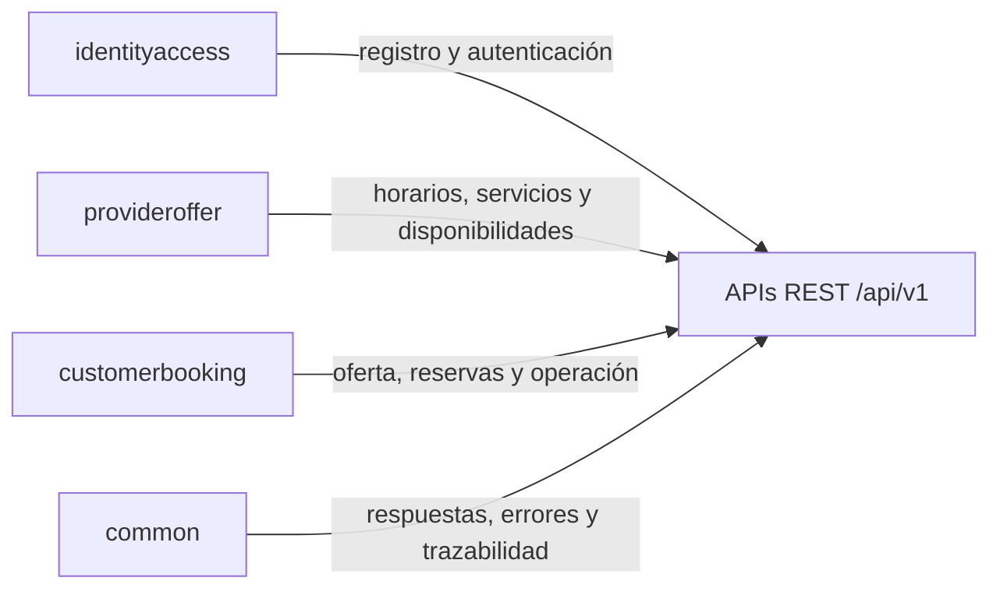

# Documentación integral de APIs REST

## Propósito

Este portal reúne la documentación funcional y técnica de todas las APIs REST expuestas por el backend del proyecto EAP09 - Caso 15. La organización se apoya en las historias de usuario implementadas por sprint, en la estructura modular real del código y en los contratos observables en controladores, DTOs, seguridad y pruebas automatizadas.

> [!NOTE]
> Esta documentación no inventa endpoints ni contratos. Cada ruta, request, response, regla de negocio y condición de seguridad fue elaborada a partir del código del proyecto y de la configuración OpenAPI/Swagger disponible.

## Índice rápido

- [Sprint 1](./sprint-1/README.md)
- [Sprint 2](./sprint-2/README.md)
- [Endpoints auxiliares](./auxiliares/README.md)
- [Recursos comunes y contratos](./recursos/README.md)

## Organización documental

| Sección | Enfoque | Contenido principal |
| --- | --- | --- |
| [Sprint 1](./sprint-1/README.md) | Flujo base de reserva | registro, autenticación, oferta, disponibilidades, creación de reservas |
| [Sprint 2](./sprint-2/README.md) | Operación posterior y autogestión | cierre de sesión, actualización de perfil, consulta y gestión posterior de reservas |
| [Auxiliares](./auxiliares/README.md) | Endpoints de soporte | bootstrap funcional y health/status |
| [Recursos](./recursos/README.md) | Convenciones comunes | wrappers de respuesta, seguridad, errores, OpenAPI y validación |

## Mapa de módulos

## Resumen general de APIs

| Sprint / Grupo | HU o grupo | Método | Ruta | Módulo | Documento |
| --- | --- | --- | --- | --- | --- |
| Sprint 1 | HU-01 Registro de cliente | `POST` | `/api/v1/clients` | `identityaccess` | [HU-01](./sprint-1/hu-01-registro-cliente.md) |
| Sprint 1 | HU-02 Registro de proveedor | `POST` | `/api/v1/providers` | `identityaccess` | [HU-02](./sprint-1/hu-02-registro-proveedor.md) |
| Sprint 1 | HU-03 Autenticación | `POST` | `/api/v1/auth/sessions` | `identityaccess` | [HU-03](./sprint-1/hu-03-autenticacion.md) |
| Sprint 1 | HU-08 Horario general del proveedor | `PUT` | `/api/v1/providers/me/general-schedule/{dayOfWeek}` | `provideroffer` | [HU-08](./sprint-1/hu-08-horario-general-proveedor.md) |
| Sprint 1 | HU-09 Registro de servicio | `POST` | `/api/v1/providers/me/services` | `provideroffer` | [HU-09](./sprint-1/hu-09-registro-servicio.md) |
| Sprint 1 | HU-11 Gestión de disponibilidad | `POST` / `PATCH` | `/api/v1/providers/me/services/{serviceId}/availabilities` / `/api/v1/providers/me/services/{serviceId}/availabilities/{availabilityId}/block` | `provideroffer` | [HU-11](./sprint-1/hu-11-gestion-disponibilidad.md) |
| Sprint 1 | HU-14 Consulta de oferta | `GET` | `/api/v1/offers` | `customerbooking` | [HU-14](./sprint-1/hu-14-consulta-oferta.md) |
| Sprint 1 | HU-15 Consulta de horarios y cupos | `GET` | `/api/v1/providers/{providerId}/services/{serviceId}/availabilities` | `customerbooking` | [HU-15](./sprint-1/hu-15-consulta-horarios-y-cupos.md) |
| Sprint 1 | HU-16 Creación de reserva | `POST` | `/api/v1/bookings` | `customerbooking` | [HU-16](./sprint-1/hu-16-creacion-reserva.md) |
| Sprint 2 | HU-04 Cierre de sesión segura | `DELETE` | `/api/v1/auth/sessions/current` | `identityaccess` | [HU-04](./sprint-2/hu-04-cierre-sesion-segura.md) |
| Sprint 2 | HU-05 Actualización de perfil | `PATCH` | `/api/v1/users/me/profile` | `identityaccess` | [HU-05](./sprint-2/hu-05-actualizacion-perfil.md) |
| Sprint 2 | HU-10 Estado de servicio | `PATCH` | `/api/v1/providers/me/services/{serviceId}/status` | `provideroffer` | [HU-10](./sprint-2/hu-10-estado-servicio.md) |
| Sprint 2 | HU-12 Consulta de reservas del proveedor | `GET` | `/api/v1/providers/me/bookings` | `customerbooking` | [HU-12](./sprint-2/hu-12-consulta-reservas-proveedor.md) |
| Sprint 2 | HU-13 Finalización de reserva | `PATCH` | `/api/v1/providers/me/bookings/{bookingId}/finalization` | `customerbooking` | [HU-13](./sprint-2/hu-13-finalizacion-reserva.md) |
| Sprint 2 | HU-17 Cancelación de reserva | `PATCH` | `/api/v1/bookings/{bookingId}/cancellation` | `customerbooking` | [HU-17](./sprint-2/hu-17-cancelacion-reserva.md) |
| Sprint 2 | HU-19 Consulta de reservas del cliente | `GET` | `/api/v1/bookings/me` | `customerbooking` | [HU-19](./sprint-2/hu-19-consulta-reservas-cliente.md) |
| Auxiliares | Bootstrap y status | `GET` | rutas auxiliares `public`, `protected` y `auth` | `common`, `identityaccess`, `provideroffer`, `customerbooking` | [Auxiliares](./auxiliares/bootstrap-y-health.md) |

## Seguridad JWT

- El backend utiliza autenticación `Bearer` con JWT.
- Las rutas públicas se concentran en registro, autenticación, OpenAPI y health.
- Las operaciones autenticadas se restringen por rol y, cuando corresponde, por propiedad del recurso.
- La invalidación de sesión se apoya en la sesión registrada y en el identificador `jti` del token.

Más detalle en: [Recursos comunes y contratos](./recursos/README.md)

## OpenAPI y Swagger

- UI de Swagger: `/swagger-ui.html`
- Documento OpenAPI: `/v3/api-docs`
- Configuración observada: `bearerAuth` para endpoints protegidos y anotaciones por operación en controladores.

## Validación y pruebas

- Validación de entrada con `jakarta.validation` en DTOs donde aplica.
- Validaciones de negocio en servicios de aplicación.
- Manejo uniforme de errores mediante `GlobalExceptionHandler`.
- Evidencia de pruebas `@WebMvcTest` y `@SpringBootTest` en `src/test/java`.

## Navegación

- [Ir a Sprint 1](./sprint-1/README.md)
- [Ir a Sprint 2](./sprint-2/README.md)
- [Ir a Auxiliares](./auxiliares/README.md)
- [Ir a Recursos comunes](./recursos/README.md)