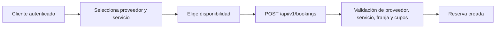

# HU-16 · Creación de reserva

## 1. Propósito funcional

Permitir que el cliente autenticado cree una reserva sobre un proveedor, un servicio y una disponibilidad específicos, respetando las reglas operativas del dominio.

## 2. Historia de usuario relacionada

**HU-16 Creación de reserva**

## 3. Actor principal

Cliente autenticado.

## 4. Módulo del backend

`customerbooking`

## 5. Endpoint incluido

| Método | Ruta |
| --- | --- |
| `POST` | `/api/v1/bookings` |

## 6. Método HTTP

`POST`

## 7. Ruta

`/api/v1/bookings`

## 8. Autenticación requerida

Sí. JWT válido.

## 9. Rol esperado

`CLIENTE`

## 10. Descripción general

Esta API concreta la reserva del servicio seleccionado. A nivel de negocio, valida que el proveedor, el servicio y la disponibilidad sean consistentes entre sí, que estén operativamente habilitados y que existan cupos disponibles antes de registrar la reserva.

## 11. Flujo básico de uso



## 12. Parámetros de ruta o query

No aplica.

## 13. Estructura del request

| Campo | Tipo | Obligatorio | Observaciones |
| --- | --- | --- | --- |
| `providerId` | `number` | Sí | Identificador del proveedor |
| `serviceId` | `number` | Sí | Identificador del servicio |
| `availabilityId` | `number` | Sí | Identificador de la franja seleccionada |

## 14. Ejemplo de request

```json
{
  "providerId": 205,
  "serviceId": 310,
  "availabilityId": 811
}
```

## 15. Estructura del response exitoso

| Campo | Tipo | Descripción |
| --- | --- | --- |
| `message` | `string` | Confirmación de la creación |
| `data.bookingId` | `number` | Identificador de la reserva |
| `data.providerId` | `number` | Proveedor asociado |
| `data.serviceId` | `number` | Servicio asociado |
| `data.availabilityId` | `number` | Disponibilidad utilizada |
| `data.customerId` | `number` | Cliente autenticado |
| `data.slotDate` | `string` | Fecha reservada |
| `data.bookingStatus` | `string` | Estado inicial de la reserva |
| `data.createdAt` | `string` | Fecha y hora de creación |
| `traceId` | `string` | Trazabilidad |

## 16. Ejemplo de response exitoso

```json
{
  "message": "Reserva creada correctamente",
  "data": {
    "bookingId": 990,
    "providerId": 205,
    "serviceId": 310,
    "availabilityId": 811,
    "customerId": 101,
    "slotDate": "2026-04-20",
    "bookingStatus": "CREADA",
    "createdAt": "2026-04-20T09:30:00-05:00"
  },
  "traceId": "d1d71c13-31b8-4d18-a8d2-76ea0c95d69a"
}
```

## 17. Posibles errores y códigos HTTP

| Código | Caso típico |
| --- | --- |
| `400` | Proveedor, servicio o disponibilidad requeridos |
| `403` | Acceso permitido solo para clientes autenticados |
| `404` | Entidad relacionada no encontrada |
| `409` | Conflicto por estado, pertenencia o falta de cupos |
| `500` | Fallo inesperado al persistir la reserva |

## 18. Reglas de negocio importantes

- El proveedor debe existir y estar activo.
- El servicio debe existir, estar activo y pertenecer al proveedor indicado.
- La disponibilidad debe existir, estar habilitada y pertenecer al servicio.
- La reserva solo procede si aún hay cupos disponibles.
- La reserva se crea con estado `CREADA`.

## 19. Validaciones principales

- `providerId`, `serviceId` y `availabilityId` deben enviarse en el body.
- La consistencia entre proveedor, servicio y disponibilidad se valida en la lógica de negocio.

## 20. Notas de seguridad

- Requiere JWT válido.
- Solo un cliente autenticado puede crear reservas.
- La operación es transaccional para preservar consistencia en caso de error.

## 21. Relación con otras APIs

- Consume el contexto de [HU-14](./hu-14-consulta-oferta.md) y [HU-15](./hu-15-consulta-horarios-y-cupos.md).
- La reserva creada se consulta después en [HU-19](../sprint-2/hu-19-consulta-reservas-cliente.md).
- Puede finalizar o cancelarse posteriormente con [HU-13](../sprint-2/hu-13-finalizacion-reserva.md) y [HU-17](../sprint-2/hu-17-cancelacion-reserva.md).

## 22. Casos de prueba sugeridos

- Creación exitosa de reserva.
- Rechazo por proveedor inactivo o inexistente.
- Rechazo por servicio no asociado al proveedor.
- Rechazo por cupos agotados.

## 23. Conclusión breve

Esta API cierra el flujo base del sprint al transformar la disponibilidad consultada en una reserva persistida y trazable.

## 24. Navegación al documento anterior/siguiente

- Anterior: [HU-15 · Consulta de horarios y cupos](./hu-15-consulta-horarios-y-cupos.md)
- Siguiente: [HU-04 · Cierre de sesión segura](../sprint-2/hu-04-cierre-sesion-segura.md)

## 25. Enlace de retorno al índice del sprint

- [Volver al índice del sprint](./README.md)

## 26. Enlace de retorno al índice general

- [Volver al índice general](../README.md)